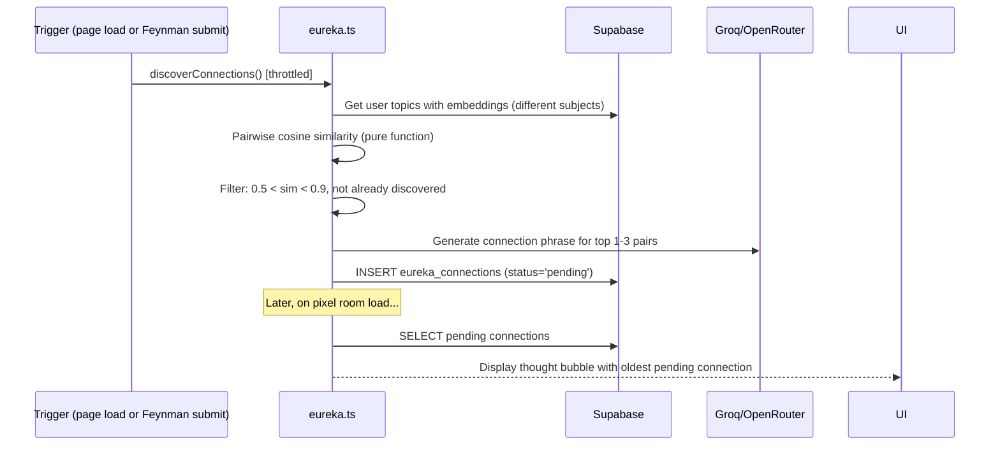

# Cross-Topic "Eureka" Connections — Design

## Overview

Eureka Connections is a passive discovery system that uses embeddings to find surprising cross-subject parallels. It runs as a throttled background job (daily or on Feynman submission), stores discoveries for async presentation, and presents them as delightful pet thought-bubbles. The challenge pathway reuses the Feynman evaluation pipeline for consistent grading.

### Key Design Decisions

1. **Background job, not real-time**: Computation is expensive (pairwise similarity). Run at most once per 6 hours and cache results.
2. **Similarity window [0.5, 0.9]**: Below 0.5 is random noise, above 0.9 is duplicate content. The interesting zone is 0.5–0.9.
3. **Cross-subject only**: Within-subject connections are already visible in the Knowledge Web. Eureka targets the surprising cross-discipline insights.
4. **Presentation via pet**: Aligns with the emotional-companion UX. Eureka feels like the pet is having an insight, not the system lecturing.
5. **Feynman pipeline reuse**: The challenge evaluation uses `evaluateExplanation()` with both topic descriptions as source context. Zero new evaluation logic.

---

## Architecture

```
src/app/(protected)/app/_actions/
├── eureka.ts                         # Server actions: discover, getConnections, submitChallenge

src/app/(protected)/app/_components/
├── eureka/
│   ├── eureka-thought-bubble.tsx     # Pet thought-bubble notification
│   ├── eureka-connection-card.tsx    # Full connection detail + challenge prompt
│   ├── eureka-challenge.tsx          # Explanation submission form
│   └── eureka-history.tsx            # Past connections list

src/lib/
├── eureka-discovery.ts               # Pure: find cross-topic similarity pairs
```

### Data Flow



---

## Connection Discovery (Pure Function)

```typescript
// src/lib/eureka-discovery.ts

interface TopicWithEmbedding {
  id: string;
  name: string;
  subject: string;
  embedding: number[];
  description?: string;
}

interface DiscoveredPair {
  topicA: TopicWithEmbedding;
  topicB: TopicWithEmbedding;
  similarity: number;
}

export function findCrossTopicConnections(
  topics: TopicWithEmbedding[],
  existingPairs: Set<string>, // "topicA_id:topicB_id" already discovered
  maxResults: number = 3
): DiscoveredPair[] {
  const pairs: DiscoveredPair[] = [];

  for (let i = 0; i < topics.length; i++) {
    for (let j = i + 1; j < topics.length; j++) {
      const a = topics[i], b = topics[j];
      // Skip same-subject pairs
      if (a.subject === b.subject) continue;
      // Skip already discovered
      const pairKey = [a.id, b.id].sort().join(':');
      if (existingPairs.has(pairKey)) continue;
      
      const sim = cosineSimilarity(a.embedding, b.embedding);
      if (sim > 0.5 && sim < 0.9) {
        pairs.push({ topicA: a, topicB: b, similarity: sim });
      }
    }
  }

  return pairs.sort((a, b) => b.similarity - a.similarity).slice(0, maxResults);
}
```

---

## Data Model

### Migration: `019_eureka_connections.sql`

```sql
CREATE TABLE eureka_connections (
  id UUID PRIMARY KEY DEFAULT gen_random_uuid(),
  user_id UUID NOT NULL REFERENCES auth.users(id) ON DELETE CASCADE,
  topic_a_id UUID NOT NULL REFERENCES topics(id) ON DELETE CASCADE,
  topic_b_id UUID NOT NULL REFERENCES topics(id) ON DELETE CASCADE,
  similarity_score FLOAT NOT NULL CHECK (similarity_score BETWEEN 0 AND 1),
  connection_phrase TEXT NOT NULL CHECK (length(connection_phrase) BETWEEN 50 AND 300),
  status TEXT NOT NULL DEFAULT 'pending' CHECK (status IN ('pending', 'viewed', 'completed', 'dismissed')),
  attempts JSONB DEFAULT '[]', -- [{text, score, createdAt}]
  xp_awarded INTEGER NOT NULL DEFAULT 0,
  created_at TIMESTAMPTZ NOT NULL DEFAULT now(),
  UNIQUE(user_id, topic_a_id, topic_b_id)
);

CREATE INDEX idx_eureka_user_status ON eureka_connections(user_id, status, created_at DESC);
CREATE INDEX idx_eureka_user_created ON eureka_connections(user_id, created_at DESC);

ALTER TABLE eureka_connections ENABLE ROW LEVEL SECURITY;

CREATE POLICY "Users manage own connections"
  ON eureka_connections FOR ALL USING (user_id = auth.uid());
```

---

## Correctness Properties

### Property 1: Cross-subject only
*For any* discovered pair, topicA.subject SHALL differ from topicB.subject.
**Validates: Requirement 1.2**

### Property 2: Similarity bounds
*For any* stored connection, similarity_score SHALL be between 0.5 and 0.9 exclusive.
**Validates: Requirements 1.3, 1.4**

### Property 3: Daily limit
*For any* user on any given day, at most 3 new connections SHALL be created.
**Validates: Requirement 1.5**

### Property 4: No duplicates
*For any* user and topic pair (A, B), at most one eureka_connections record SHALL exist regardless of order (A,B is same as B,A).
**Validates: Requirement 1.6**

### Property 5: Challenge scoring threshold
*For any* challenge attempt with score ≥ 60, the connection SHALL be marked completed and XP awarded. Score < 60 → not marked complete.
**Validates: Requirement 3.3, 3.4**

---

## Error Handling

| Scenario | Handling |
|----------|----------|
| No embeddings available for topics | Skip discovery, return empty |
| Fewer than 2 subjects | Skip discovery (nothing to cross-connect) |
| LLM unavailable for phrase generation | Store connection without phrase, generate later |
| Challenge evaluation fails | Allow retry, preserve text |
| > 50 connections stored | Delete oldest dismissed connections |
| Pairwise computation too slow (> 100 topics) | Sample random subset (30 topics) per run |

---

## Presentation

### Thought Bubble Animation

```css
@keyframes thought-float {
  0% { transform: translateY(0) scale(0); opacity: 0; }
  20% { transform: translateY(-8px) scale(1); opacity: 1; }
  80% { transform: translateY(-8px) scale(1); opacity: 1; }
  100% { transform: translateY(-16px) scale(0.8); opacity: 0; }
}

.eureka-bubble {
  position: absolute;
  top: -40px;
  animation: thought-float 4s ease-out forwards;
}
```

The bubble contains a lightbulb (💡) pixel icon and a brief text snippet. Clicking expands to the full connection card.

---

## Integration Points

- **Feynman pipeline**: Challenge evaluation calls `evaluateExplanation()` with both topic descriptions as source context
- **Gamification**: `rewardAction("eureka")` — 25 XP, 10 coins (new action type)
- **Pet system**: Thought-bubble animation triggered via pet state management
- **Knowledge Web**: Discovered connections can optionally inform the concept map (future enhancement)
- **Pixel Room**: Thought bubble rendered above pet sprite position
