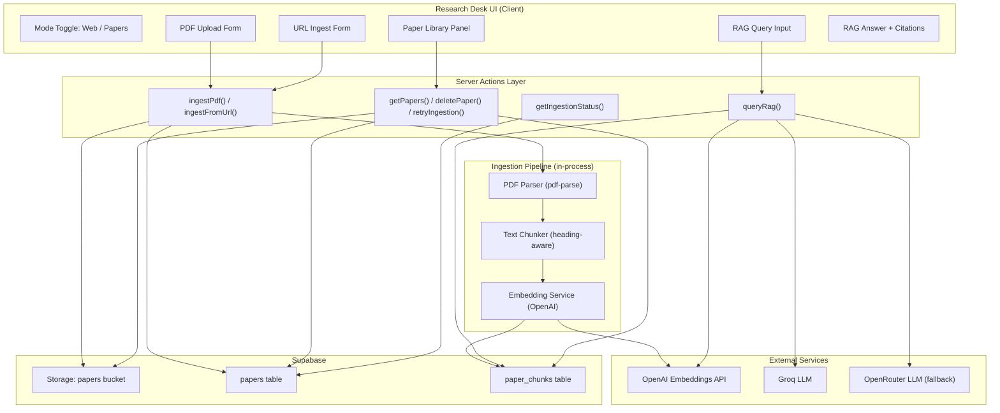
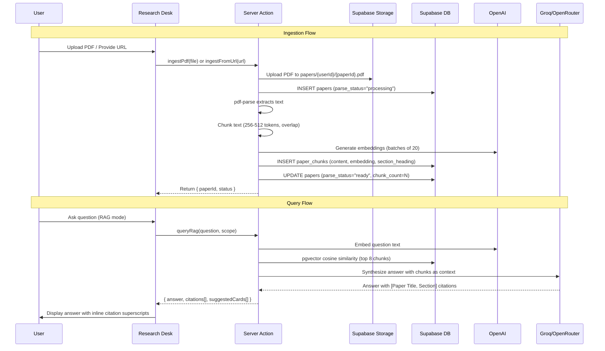

# Design Document: Full RAG Research

## Overview

This design adds a full Retrieval-Augmented Generation (RAG) pipeline to the existing AI Research Desk at `/app/research`. The feature enables students to upload or download academic PDFs, which are then parsed, chunked, embedded, and stored in the existing `paper_chunks` table (with pgvector). A dedicated RAG query engine searches these embeddings and synthesizes cited answers grounded in the actual paper content.

The existing web research mode (Wikipedia + Open Library + Groq synthesis) remains completely untouched. The two modes coexist on the same page behind a clear toggle: **"From your papers"** (RAG) vs **"From web sources"** (existing). They share no query logic.

### Key Design Decisions

| Decision | Rationale |
|----------|-----------|
| Server actions for all backend logic (no Edge Functions) | Matches existing app architecture; pdf-parse requires full Node.js runtime |
| OpenAI text-embedding-3-small for embeddings | 1536 dims matches existing `paper_chunks.embedding vector(1536)` column; configurable via `OPENAI_EMBEDDING_MODEL` env var (default `text-embedding-3-small`, also supports `text-embedding-ada-002`) |
| Polling-based progress (not WebSocket/SSE) | Simplest approach with server actions; client polls paper `parse_status` + `chunk_count` |
| Dual-mode retrieval (FTS free / pgvector paid) | Dev mode uses Postgres full-text search (free, uses Groq for keyword extraction); hackathon mode uses OpenAI embeddings + pgvector when `OPENAI_API_KEY` is present. Same UI, same API, only internal retrieval switches. |
| Supabase Storage for PDF files | Already available; user-scoped paths provide isolation via RLS |
| Single new server action file `rag.ts` | Separates RAG concerns from existing `research.ts` |
| Groq primary / OpenRouter fallback for LLM | Matches existing pattern in `research.ts` |

## Architecture



### Data Flow: Upload → Parse → Chunk → Embed → Store → Query → Answer



## Components and Interfaces

### Server Action Files

#### `_actions/rag.ts` — New file (primary RAG logic)

```typescript
// Core interfaces
interface IngestionResult {
  paperId: string;
  status: "processing" | "failed";
  error?: string;
}

interface RagAnswer {
  answer: string;
  citations: Citation[];
  suggestedCards: { front: string; back: string }[];
}

interface Citation {
  paperId: string;
  paperTitle: string;
  sectionHeading: string;
  chunkIndex: number;
  snippet: string; // max 300 chars
}

interface IngestionProgress {
  paperId: string;
  parseStatus: "pending" | "processing" | "ready" | "partial" | "failed";
  parseError: string | null;
  chunkCount: number;
  stage?: "downloading" | "parsing" | "chunking" | "embedding";
  embeddedCount?: number;
  totalChunks?: number;
}

// Exported server actions
export async function ingestPdf(formData: FormData): Promise<IngestionResult>;
export async function ingestFromUrl(url: string, paperId?: string): Promise<IngestionResult>;
export async function queryRag(question: string, scope: RagScope): Promise<{ data?: RagAnswer; error?: string }>;
export async function getIngestionStatus(paperId: string): Promise<IngestionProgress>;
export async function retryIngestion(paperId: string): Promise<IngestionResult>;
export async function deleteFullPaper(paperId: string): Promise<{ success?: boolean; error?: string }>;
```

#### `_actions/research.ts` — Existing file (unchanged)

No modifications. Web research mode continues to use `performResearch()`, `saveSource()`, `createCardsFromResearch()`, `getSavedPapers()`, `deletePaper()` as-is.

### Internal Modules (non-exported helpers within `rag.ts`)

| Module | Responsibility |
|--------|---------------|
| `parsePdf(buffer: Buffer)` | Calls pdf-parse, extracts text with heading detection |
| `chunkText(sections: Section[])` | Splits text into 256-512 token chunks with 10-15% overlap |
| `generateEmbeddings(texts: string[])` | Calls OpenAI embeddings (configurable model, default text-embedding-3-small) in batches of 20, handles retries |
| `vectorSearch(embedding: number[], scope, limit)` | RPC/raw SQL for pgvector cosine similarity (requires OPENAI_API_KEY) |
| `fullTextSearch(keywords: string[], scope, limit)` | Postgres tsvector/tsquery search (free fallback when no embeddings) |
| `retrieveChunks(question: string, scope)` | Common interface — routes to vectorSearch or fullTextSearch based on `process.env.OPENAI_API_KEY` |
| `synthesizeRagAnswer(question: string, chunks: Chunk[])` | LLM call with Groq/OpenRouter fallback |

### Client Components

#### New Components (in `research/_components/`)

| Component | Responsibility |
|-----------|---------------|
| `research-mode-toggle.tsx` | Tabs: "From web sources" / "From your papers" |
| `rag-query-panel.tsx` | Query input + scope selector (all papers / specific paper / topic) |
| `rag-answer-display.tsx` | Answer text with inline citation superscripts + citations panel |
| `paper-upload.tsx` | PDF upload form + URL input form |
| `paper-library.tsx` | List of user's papers with status badges + management actions |
| `ingestion-progress.tsx` | Polling progress indicator (stage + chunk count) |
| `card-from-rag.tsx` | Text selection → card creation flow |

#### Modified Components

| Component | Change |
|-----------|--------|
| `research-desk.tsx` | Wraps existing content in the "From web sources" tab; adds mode toggle and imports new RAG components |

### Supabase RPC Function

```sql
-- Vector similarity search function
CREATE OR REPLACE FUNCTION match_paper_chunks(
  query_embedding vector(1536),
  match_user_id UUID,
  match_paper_id UUID DEFAULT NULL,
  match_topic_id UUID DEFAULT NULL,
  match_threshold FLOAT DEFAULT 0.3,
  match_count INT DEFAULT 8
)
RETURNS TABLE (
  id UUID,
  paper_id UUID,
  chunk_index INT,
  content TEXT,
  section_heading TEXT,
  similarity FLOAT
)
LANGUAGE plpgsql
AS $$
BEGIN
  RETURN QUERY
  SELECT
    pc.id,
    pc.paper_id,
    pc.chunk_index,
    pc.content,
    pc.section_heading,
    1 - (pc.embedding <=> query_embedding) AS similarity
  FROM paper_chunks pc
  JOIN papers p ON p.id = pc.paper_id
  WHERE pc.user_id = match_user_id
    AND pc.embedding IS NOT NULL
    AND (match_paper_id IS NULL OR pc.paper_id = match_paper_id)
    AND (match_topic_id IS NULL OR p.topic_id = match_topic_id)
    AND 1 - (pc.embedding <=> query_embedding) > match_threshold
  ORDER BY similarity DESC
  LIMIT match_count;
END;
$$;
```

## Data Models

### Schema Migration: `003_rag_extensions.sql`

```sql
-- Add parse status tracking to papers
ALTER TABLE papers
  ADD COLUMN parse_status TEXT DEFAULT 'pending'
    CHECK (parse_status IN ('pending', 'processing', 'ready', 'partial', 'failed')),
  ADD COLUMN parse_error TEXT,
  ADD COLUMN chunk_count INTEGER DEFAULT 0 CHECK (chunk_count >= 0),
  ADD COLUMN storage_path TEXT;

-- Add CHECK constraint for parse_error consistency
ALTER TABLE papers
  ADD CONSTRAINT papers_parse_error_check
    CHECK (
      (parse_status IN ('pending', 'processing', 'ready') AND parse_error IS NULL)
      OR parse_status IN ('failed', 'partial')
    );

-- Add section heading to paper_chunks
ALTER TABLE paper_chunks
  ADD COLUMN section_heading TEXT;

-- Add full-text search support (free dev mode — used when OPENAI_API_KEY is absent)
ALTER TABLE paper_chunks
  ADD COLUMN content_tsv tsvector GENERATED ALWAYS AS (to_tsvector('english', content)) STORED;

CREATE INDEX idx_paper_chunks_tsv ON paper_chunks USING GIN (content_tsv);

-- Add constraint on section_heading length
ALTER TABLE paper_chunks
  ADD CONSTRAINT paper_chunks_section_heading_length
    CHECK (section_heading IS NULL OR length(section_heading) <= 500);

-- Add constraint on parse_error length
ALTER TABLE papers
  ADD CONSTRAINT papers_parse_error_length
    CHECK (parse_error IS NULL OR length(parse_error) <= 2000);
```

### Updated Table Schemas

#### `papers` (after migration)

| Column | Type | Constraints | Notes |
|--------|------|-------------|-------|
| id | UUID | PK, default gen_random_uuid() | |
| user_id | UUID | FK → auth.users, NOT NULL | RLS enforced |
| topic_id | UUID | FK → topics, nullable | |
| title | TEXT | NOT NULL | From PDF metadata or filename |
| authors | TEXT[] | nullable | |
| year | INTEGER | nullable | |
| citation_count | INTEGER | nullable | |
| abstract | TEXT | nullable | |
| url | TEXT | nullable | Source URL if ingested via URL |
| semantic_scholar_id | TEXT | nullable | |
| **parse_status** | TEXT | DEFAULT 'pending', CHECK enum | NEW |
| **parse_error** | TEXT | nullable, max 2000 chars | NEW |
| **chunk_count** | INTEGER | DEFAULT 0, CHECK >= 0 | NEW |
| **storage_path** | TEXT | nullable | NEW — path in Supabase Storage |
| created_at | TIMESTAMPTZ | DEFAULT now() | |

#### `paper_chunks` (after migration)

| Column | Type | Constraints | Notes |
|--------|------|-------------|-------|
| id | UUID | PK, default gen_random_uuid() | |
| user_id | UUID | FK → auth.users, NOT NULL | RLS enforced |
| paper_id | UUID | FK → papers, NOT NULL | CASCADE delete |
| chunk_index | INTEGER | NOT NULL | Zero-based |
| content | TEXT | NOT NULL | 256-512 tokens |
| **section_heading** | TEXT | nullable, max 500 chars | NEW |
| embedding | vector(1536) | nullable | OpenAI ada-002 |
| created_at | TIMESTAMPTZ | DEFAULT now() | |

### Supabase Storage Structure

```
papers/                        ← bucket name
  {user_id}/
    {paper_id}.pdf             ← user-scoped path
```

Storage RLS: users can only access their own `{user_id}/` prefix.

### TypeScript Types (shared)

```typescript
type ParseStatus = "pending" | "processing" | "ready" | "partial" | "failed";

interface Paper {
  id: string;
  title: string;
  authors: string[] | null;
  year: number | null;
  abstract: string | null;
  url: string | null;
  topicId: string | null;
  topicName: string | null;
  parseStatus: ParseStatus;
  parseError: string | null;
  chunkCount: number;
  createdAt: string;
}

interface RagScope {
  type: "all" | "paper" | "topic";
  paperId?: string;
  topicId?: string;
}
```


## Correctness Properties

*A property is a characteristic or behavior that should hold true across all valid executions of a system—essentially, a formal statement about what the system should do. Properties serve as the bridge between human-readable specifications and machine-verifiable correctness guarantees.*

### Property 1: Upload input validation

*For any* file submission with a random size (0–100 MB), random extension, and random MIME type, the ingestion validator SHALL accept the file if and only if the extension is `.pdf`, the MIME type is `application/pdf`, and the file size is at most 20 MB.

**Validates: Requirements 1.1, 1.2, 1.4**

### Property 2: Title extraction from metadata or filename

*For any* valid PDF buffer with randomly generated metadata (title field possibly null) and a random original filename ending in `.pdf`, the created Paper record's `title` field SHALL equal the PDF metadata title when present and non-empty, or the filename without the `.pdf` extension otherwise.

**Validates: Requirements 1.6, 1.7**

### Property 3: URL input validation

*For any* string representing a URL with a random scheme (http, https, ftp, file, etc.) and random length (1–3000 characters), the URL validator SHALL accept the input if and only if the scheme is `http` or `https` and the total length is at most 2048 characters.

**Validates: Requirements 2.1, 2.7**

### Property 4: Minimum text extraction threshold

*For any* extracted text string, if the non-whitespace character count is fewer than 20, the ingestion pipeline SHALL mark the paper's `parse_status` as `"failed"`. If the count is 20 or more, it SHALL proceed to chunking.

**Validates: Requirements 3.4**

### Property 5: Chunk token bounds invariant

*For any* input text of arbitrary length containing paragraphs and optional section headings, every chunk produced by the chunking algorithm SHALL contain between 256 and 512 tokens inclusive. No chunk (including the final one) SHALL be stored with fewer than 256 tokens.

**Validates: Requirements 4.1, 4.3, 4.4**

### Property 6: Consecutive chunk overlap

*For any* pair of consecutive chunks produced from the same input text, the token overlap between them (measured as tokens shared at the boundary) SHALL be between 10% and 15% of the preceding chunk's token count, rounded down to the nearest whole token.

**Validates: Requirements 4.2**

### Property 7: Chunk schema completeness

*For any* input text with an arbitrary number of sections (each with a heading and body paragraphs), every chunk in the output SHALL have: a zero-based sequential `chunk_index`, non-empty `content`, a valid `paper_id`, and a `section_heading` (the associated heading string, or an empty string if no heading is associated).

**Validates: Requirements 4.5**

### Property 8: Embedding batch sizing

*For any* set of N chunks (where N is between 1 and 500), the embedding service SHALL partition them into ceiling(N/20) batches, each containing at most 20 chunks, with the final batch containing the remainder.

**Validates: Requirements 5.5**

### Property 9: Empty chunk embedding skip

*For any* chunk whose `content` is empty or consists entirely of whitespace characters, the embedding service SHALL skip embedding generation and store the chunk with a null `embedding` value. For any chunk with at least one non-whitespace character, the service SHALL generate a non-null embedding.

**Validates: Requirements 5.7**

### Property 10: Question length validation

*For any* string of random length, the RAG engine SHALL accept the input as a valid question if and only if it contains between 3 and 500 characters inclusive.

**Validates: Requirements 6.1, 6.9, 13.6**

### Property 11: RAG prompt includes all retrieved chunks

*For any* set of 1 to 8 retrieved chunks (each with paper title, section heading, and content), the constructed LLM prompt SHALL contain the content of every retrieved chunk and SHALL include citation format instructions specifying `[Paper Title, Section]`.

**Validates: Requirements 6.5**

### Property 12: Answer and citation response structure

*For any* valid RAG response, the answer text SHALL be at most 3000 characters, and every citation object SHALL contain: a non-empty `paperId`, a non-negative `chunkIndex`, a `sectionHeading` string, and a `snippet` of at most 300 characters.

**Validates: Requirements 6.6**

### Property 13: Card field length validation

*For any* card creation attempt, the front field SHALL be accepted if and only if it is between 1 and 200 non-whitespace-only characters, and the back field SHALL be accepted if and only if it is between 1 and 1000 non-whitespace-only characters.

**Validates: Requirements 8.3, 8.7**

### Property 14: Suggested cards count bound

*For any* RAG answer response containing suggested flashcard pairs, the number of pairs SHALL be between 1 and 5 inclusive.

**Validates: Requirements 8.5**

### Property 15: Feynman selection length validation

*For any* text selection of random length, the "Send to Feynman" action SHALL be enabled if and only if the selection length is between 10 and 500 characters inclusive.

**Validates: Requirements 9.1, 9.2**

### Property 16: Rate limit wait time calculation

*For any* HTTP 429 response with a random `Retry-After` header value (including absent), the calculated wait time SHALL equal the `Retry-After` value in seconds when the header is present and parseable, or 60 seconds when the header is absent or unparseable.

**Validates: Requirements 12.1**

### Property 17: Embedding concurrency limit

*For any* sequence of embedding requests from a single user, the system SHALL never have more than 2 concurrent in-flight embedding API calls for that user at any point in time.

**Validates: Requirements 12.4**

### Property 18: Parse status and error consistency

*For any* paper record, if `parse_status` is one of `"pending"`, `"processing"`, or `"ready"`, then `parse_error` SHALL be `NULL`. If `parse_status` is `"failed"` or `"partial"`, then `parse_error` MAY be non-null.

**Validates: Requirements 14.2, 14.6**

## Error Handling

### Ingestion Pipeline Errors

| Error Scenario | Handling | User Feedback |
|---------------|----------|---------------|
| File too large (>20 MB upload / >50 MB download) | Reject immediately, no DB record | Inline error: "File exceeds maximum size" |
| Invalid file type | Reject before storage | Inline error: "Only PDF files are accepted" |
| PDF corrupted / unreadable | `pdf-parse` throws → no Paper record | Inline error: "File could not be parsed" |
| Extracted text < 20 chars | Mark `parse_status = "failed"` | Status badge + error text |
| Parse timeout (>60s) | Abort, mark failed | Status badge + "Processing timeout" |
| Embedding API failure (after 3 retries) | Mark `parse_status = "partial"`, store chunks without embeddings | Status badge + "Partial indexing" + Retry button |
| Embedding rate limit (429) | Respect `Retry-After` or wait 60s, then retry | Progress indicator pauses, no user action needed |
| Invalid/missing OPENAI_API_KEY | Mark `parse_status = "failed"` | Status badge + "Embedding service unavailable" |
| URL unreachable / non-PDF | Return error, no record | Inline error with specific reason |
| URL download timeout (>30s) | Abort | Inline error: "Download timed out" |

### RAG Query Errors

| Error Scenario | Handling | User Feedback |
|---------------|----------|---------------|
| Question too short/long | Client-side validation + server reject | Inline validation message |
| Embedding generation fails | Return error | "Paper search temporarily unavailable" |
| No relevant chunks (all < 0.3 similarity) | Return informative empty result | "No relevant content found. Try rephrasing or uploading more papers." |
| LLM timeout (>30s on Groq) | Fallback to OpenRouter | Transparent to user (slightly longer wait) |
| Both LLM providers fail | Return error | "AI synthesis temporarily unavailable, please retry in 60 seconds" |
| Empty scope (no indexed papers) | Return empty result | "No indexed papers available for the selected scope" |

### Deletion Errors

| Error Scenario | Handling | User Feedback |
|---------------|----------|---------------|
| Storage deletion fails | Retain Paper record, report partial failure | Error message: "Could not remove PDF file" |
| Chunk deletion fails | Retain Paper record | Error message: "Could not remove indexed content" |

### Global Error Patterns

- **Authentication**: All server actions check `auth.getUser()` first; return `"Not authenticated"` on failure
- **RLS**: Supabase policies ensure users only access their own data; no additional application-level checks needed
- **Retry resets**: When retrying a failed/partial paper, `parse_status` is set to `"pending"` and `parse_error` is set to `NULL` before re-running the pipeline
- **Timeouts**: All external API calls use `AbortController` with explicit timeouts (matching existing `research.ts` pattern)
- **JSON parsing**: LLM responses parsed with try/catch and fallback extraction (matching existing pattern)

## Testing Strategy

### Property-Based Testing (PBT)

This feature is well-suited for PBT because it contains multiple pure-function components (chunking algorithm, validation logic, batching, prompt construction) with clear input/output behavior and large input spaces.

**Library**: [fast-check](https://github.com/dubzzz/fast-check) (TypeScript PBT library)

**Configuration**:
- Minimum 100 iterations per property test
- Each test tagged with: `Feature: full-rag-research, Property {N}: {title}`

**Property tests to implement** (one test per property above):

| Property | Unit Under Test | Generator Strategy |
|----------|----------------|-------------------|
| 1: Upload validation | `validateUploadInput()` | Random file sizes (0-100MB), extensions, MIME types |
| 2: Title extraction | `extractTitle()` | Random PDF metadata objects + filenames |
| 3: URL validation | `validateUrl()` | Random URLs with various schemes and lengths |
| 4: Min text threshold | `checkExtractedText()` | Random strings (0-100 non-whitespace chars) |
| 5: Chunk token bounds | `chunkText()` | Random text strings (100-50000 tokens) with headings |
| 6: Chunk overlap | `chunkText()` | Same as above; assert on consecutive pairs |
| 7: Chunk schema | `chunkText()` | Random sectioned text; assert output fields |
| 8: Batch sizing | `batchChunks()` | Random arrays of 1-500 items |
| 9: Empty chunk skip | `shouldEmbed()` | Random strings including empty/whitespace |
| 10: Question validation | `validateQuestion()` | Random strings of various lengths |
| 11: Prompt construction | `buildRagPrompt()` | Random chunk arrays (1-8) with metadata |
| 12: Response structure | `parseRagResponse()` | Random response objects |
| 13: Card validation | `validateCardFields()` | Random strings for front/back |
| 14: Suggested cards count | `parseSuggestedCards()` | Random arrays of card objects |
| 15: Feynman selection | `validateFeynmanSelection()` | Random strings of various lengths |
| 16: Rate limit wait | `calculateRetryWait()` | Random header values (present/absent/malformed) |
| 17: Concurrency limit | `EmbeddingQueue` | Random request sequences |
| 18: Status consistency | `validatePaperState()` | Random (status, error) pairs |

### Unit Tests (Example-Based)

Focus areas:
- PDF parsing with known sample PDFs (valid, corrupted, image-only)
- Retry logic with mocked API failures (1, 2, 3 failures)
- LLM fallback (Groq → OpenRouter) with mocked responses
- State transitions (pending → processing → ready/failed/partial)
- Card creation with source_type verification
- Feynman navigation with context passing

### Integration Tests

Focus areas:
- Full ingestion pipeline: upload → parse → chunk → embed → verify DB state
- Vector search: seed chunks, query, verify ranked results
- Scope filtering: multi-paper/multi-topic queries
- Deletion cascade: paper + chunks + storage removed
- RLS enforcement: user A cannot access user B's papers

### E2E Smoke Tests

- Upload a small PDF, wait for "ready" status, ask a question, receive cited answer
- URL ingest from a test PDF URL
- Mode toggle between web and RAG research
- Card creation from RAG answer

