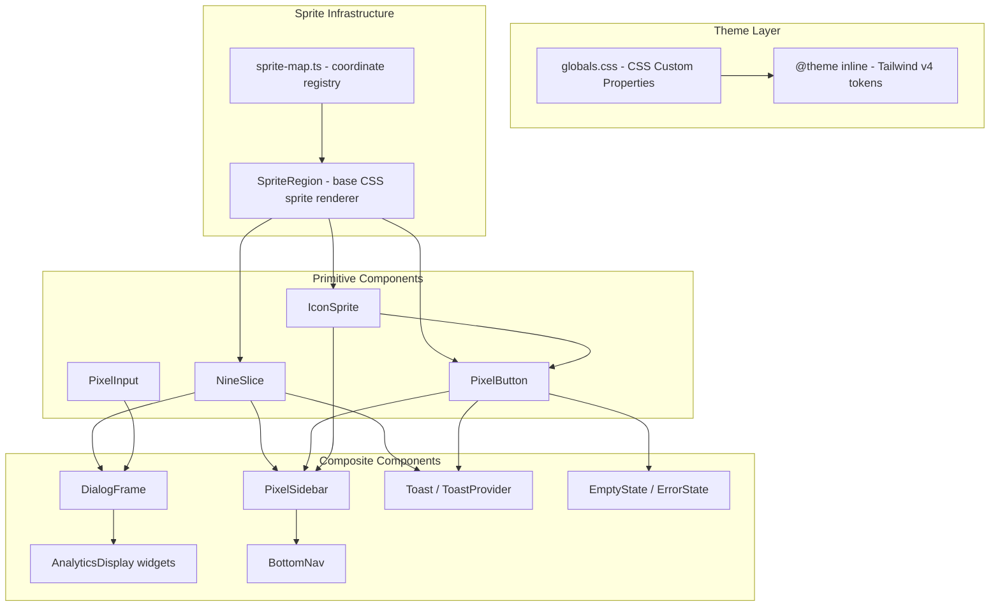
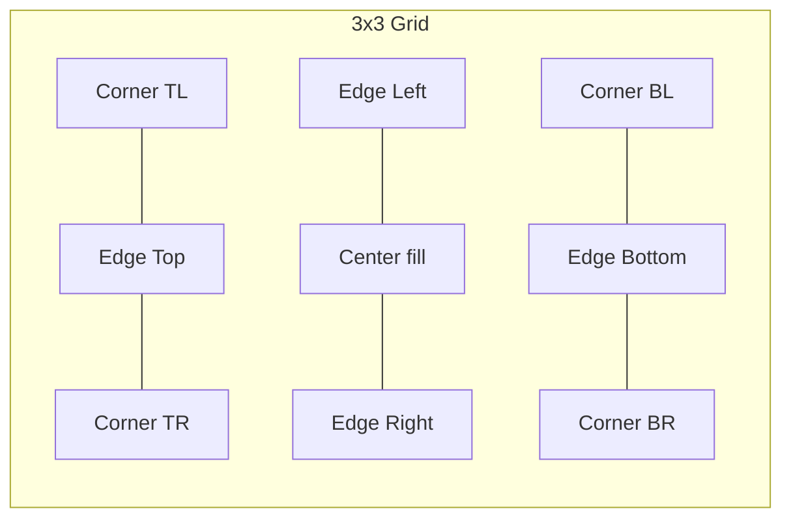
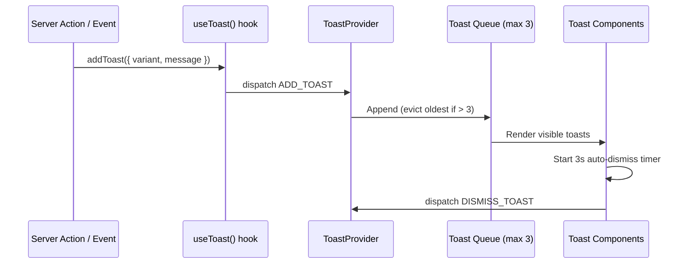

# Design Document: Pixel Art UI

## Overview

This design transforms Nora's current modern zinc/white UI into a cozy pixel-art aesthetic using the Sprout Lands UI Pack sprites. The system introduces a set of reusable, composable React components (`NineSlice`, `PixelButton`, `IconSprite`, `PixelInput`, etc.) backed by a centralized sprite map and a CSS custom property-based theme layer.

The architecture follows a **layered approach**:
1. **Theme Layer** — CSS custom properties + Tailwind v4 `@theme inline` tokens define the Color_Palette, spacing grid, and typography rules.
2. **Sprite Infrastructure** — A JSON sprite map + a base `SpriteRegion` utility component handle all sprite extraction from PNGs via CSS `background-position`.
3. **Primitive Components** — `NineSlice`, `PixelButton`, `IconSprite`, `PixelInput` are framework-agnostic presentational components.
4. **Composite Components** — `PixelSidebar`, `DialogFrame`, `Toast`, `EmptyState`, `AnalyticsDisplay` compose primitives for specific feature use.

All sprite rendering uses CSS-only techniques (no `<canvas>`), ensuring SSR compatibility with Next.js Server Components where possible.

## Architecture



### Key Architectural Decisions

| Decision | Rationale |
|----------|-----------|
| CSS `background-position` over `<canvas>` | SSR-friendly, no hydration mismatch, simpler to style with Tailwind |
| Centralized sprite-map.ts | Single source of truth for coordinates; adding sprites requires only a map update |
| Nine-slice via CSS Grid (3×3) | Corners stay fixed, edges repeat via `background-repeat`, center stretches — pure CSS, no JS resize logic |
| Client Components only where needed | Sidebar (usePathname), Toast (state), PixelButton (interactions). NineSlice and IconSprite can be Server Components |
| Tailwind v4 `@theme inline` for tokens | Keeps theme co-located in globals.css, no separate tailwind.config needed |
| Integer scaling via CSS `transform: scale(N)` | Prevents sub-pixel blur; rendered at native size then scaled up |

## Components and Interfaces

### File Structure

```
src/
├── components/
│   └── pixel-ui/
│       ├── sprite-map.ts            # Sprite coordinate registry
│       ├── sprite-region.tsx        # Base sprite rendering utility
│       ├── nine-slice.tsx           # Scalable pixel-art panel (Server Component)
│       ├── pixel-button.tsx         # Interactive button (Client Component)
│       ├── icon-sprite.tsx          # Single icon extractor (Server Component)
│       ├── pixel-input.tsx          # Form inputs (Client Component)
│       ├── dialog-frame.tsx         # Card wrapper using NineSlice
│       ├── pixel-sidebar.tsx        # Themed sidebar (Client Component)
│       ├── bottom-nav.tsx           # Mobile navigation (Client Component)
│       ├── toast.tsx                # Toast notification (Client Component)
│       ├── toast-provider.tsx       # Context provider for toast queue
│       ├── empty-state.tsx          # Empty state placeholder
│       ├── error-state.tsx          # Error state panel
│       ├── loading-skeleton.tsx     # Pixel shimmer skeleton
│       ├── pixel-progress-bar.tsx   # HP/MP style progress bar
│       ├── pixel-stat-card.tsx      # Analytics stat card
│       ├── pixel-bar-chart.tsx      # Pixel-styled bar chart
│       ├── pixel-heatmap.tsx        # Consistency heatmap grid
│       └── index.ts                 # Barrel export
├── app/
│   └── (protected)/
│       └── app/
│           └── _components/
│               └── sidebar.tsx      # Updated to use PixelSidebar
```

### Component Interfaces

```typescript
// sprite-map.ts
export interface SpriteCoord {
  x: number;       // px offset from left
  y: number;       // px offset from top
  width: number;   // native width in px
  height: number;  // native height in px
  sheet: string;   // path to spritesheet (e.g., "/sprites/ui/icons.png")
}

export type SpriteMap = Record<string, SpriteCoord>;

// The sprite map is a plain object mapping logical names to coordinates.
// Example entries:
// "button-idle": { x: 0, y: 0, width: 26, height: 26, sheet: "/sprites/ui/buttons-26x26.png" }
// "icon-book": { x: 0, y: 16, width: 16, height: 16, sheet: "/sprites/ui/icons.png" }
```

```typescript
// sprite-region.tsx
interface SpriteRegionProps {
  name: string;             // logical sprite name from sprite-map
  scale?: 1 | 2 | 3;       // integer scaling factor (default: 2)
  className?: string;
  style?: React.CSSProperties;
  "aria-label"?: string;
  "aria-hidden"?: boolean;
}
```

```typescript
// nine-slice.tsx
interface NineSliceProps {
  variant?: "standard" | "large";  // dialog-box.png vs dialog-box-big.png
  scale?: 2 | 3;                   // integer scale multiplier
  className?: string;
  style?: React.CSSProperties;
  children: React.ReactNode;
}
```

```typescript
// pixel-button.tsx
interface PixelButtonProps {
  size?: "small" | "default";       // 1x vs 2x sprite scale
  variant?: "primary" | "secondary" | "danger";
  disabled?: boolean;
  loading?: boolean;
  onClick?: () => void;
  type?: "button" | "submit" | "reset";
  className?: string;
  children: React.ReactNode;
}
```

```typescript
// icon-sprite.tsx
interface IconSpriteProps {
  name: string;                     // logical icon name
  size?: 1 | 2 | 3;                // integer scale
  "aria-label"?: string;
  fallback?: React.ComponentType<{ className?: string }>;  // Lucide fallback
  className?: string;
}
```

```typescript
// pixel-input.tsx
interface PixelInputProps {
  type?: "text" | "textarea" | "select" | "search" | "toggle";
  label?: string;
  value?: string;
  checked?: boolean;               // for toggle
  onChange?: (value: string | boolean) => void;
  options?: { label: string; value: string }[];  // for select
  placeholder?: string;
  disabled?: boolean;
  error?: string;
  className?: string;
}
```

```typescript
// dialog-frame.tsx
interface DialogFrameProps {
  title?: string;
  variant?: "standard" | "large";
  state?: "default" | "success" | "warning" | "error";
  className?: string;
  children: React.ReactNode;
}
```

```typescript
// toast.tsx & toast-provider.tsx
type ToastVariant = "success" | "warning" | "error" | "info" | "level-up";

interface Toast {
  id: string;
  variant: ToastVariant;
  message: string;
  duration?: number;           // default 3000ms
}

interface ToastContextValue {
  toasts: Toast[];
  addToast: (toast: Omit<Toast, "id">) => void;
  dismissToast: (id: string) => void;
}
```

```typescript
// empty-state.tsx
interface EmptyStateProps {
  message: string;
  actionLabel?: string;
  onAction?: () => void;
  actionHref?: string;         // for link-based actions
  icon?: string;               // sprite icon name
}
```

```typescript
// Analytics components
interface PixelStatCardProps {
  label: string;
  value: string;
  icon?: string;               // sprite name
}

interface PixelBarChartProps {
  data: { label: string; value: number }[];
  maxValue?: number;
}

interface PixelHeatmapProps {
  data: { date: string; count: number }[];
  weeks?: number;              // default 12
}

interface PixelProgressBarProps {
  value: number;               // 0-100
  max?: number;
  label?: string;
  variant?: "xp" | "hp" | "mp";
}
```

### Nine-Slice Rendering Strategy

The nine-slice component uses a **CSS Grid 3×3 layout**:



- **Corners** (4 cells): Fixed size, rendered via `background-position` + `background-size` clipping the sprite corner region
- **Edges** (4 cells): `background-repeat: repeat-x` or `repeat-y` tiling the edge slice
- **Center** (1 cell): `background-repeat: repeat` or solid Color_Palette fill

The grid column/row template uses `auto 1fr auto` so that corners stay fixed while the center stretches with content.

### Sprite Map Design

The sprite map file (`sprite-map.ts`) exports a typed `Record<string, SpriteCoord>` object. Each entry maps a logical name (used in component `name` props) to spritesheet coordinates.

```typescript
// Naming convention: "{category}-{variant}-{state}"
// Examples:
//   "button-primary-idle"
//   "button-primary-hover"  
//   "button-primary-active"
//   "button-primary-disabled"
//   "icon-book"
//   "icon-settings"
//   "dialog-standard-tl" (nine-slice corner)
//   "dialog-standard-top" (nine-slice edge)
```

Adding a new sprite requires only adding an entry to this map — no component code changes needed.

### Toast System Architecture



The `ToastProvider` wraps the app layout and manages a queue of up to 3 visible toasts. When the limit is hit, the oldest toast is evicted. Each toast renders a shrinking progress bar using CSS animation (`width: 100% → 0%` over 3s).

## Data Models

This feature is purely presentational — no database models are introduced. The "data" layer consists of:

### Sprite Map (Static Configuration)

```typescript
// src/components/pixel-ui/sprite-map.ts
export const SPRITE_SHEETS = {
  buttons: "/sprites/ui/buttons-26x26.png",
  dialogStandard: "/sprites/ui/dialog-box.png",
  dialogBig: "/sprites/ui/dialog-box-big.png",
  icons: "/sprites/ui/icons.png",
  emojis: "/sprites/ui/emojis.png",
  moodIcons: "/sprites/ui/mood-icons.png",
} as const;

export const spriteMap: SpriteMap = {
  // Buttons (26x26 spritesheet, states arranged vertically)
  "button-primary-idle":     { x: 0,  y: 0,  width: 26, height: 26, sheet: SPRITE_SHEETS.buttons },
  "button-primary-hover":    { x: 26, y: 0,  width: 26, height: 26, sheet: SPRITE_SHEETS.buttons },
  "button-primary-active":   { x: 52, y: 0,  width: 26, height: 26, sheet: SPRITE_SHEETS.buttons },
  "button-primary-disabled": { x: 78, y: 0,  width: 26, height: 26, sheet: SPRITE_SHEETS.buttons },
  
  // Nine-slice regions for standard dialog box
  "dialog-standard-tl":     { x: 0,  y: 0,  width: 6,  height: 6,  sheet: SPRITE_SHEETS.dialogStandard },
  "dialog-standard-top":    { x: 6,  y: 0,  width: 4,  height: 6,  sheet: SPRITE_SHEETS.dialogStandard },
  "dialog-standard-tr":     { x: 10, y: 0,  width: 6,  height: 6,  sheet: SPRITE_SHEETS.dialogStandard },
  // ... center, edges, corners
  
  // Icons (16x16 grid in icons.png)
  "icon-book":              { x: 0,  y: 0,  width: 16, height: 16, sheet: SPRITE_SHEETS.icons },
  "icon-settings":          { x: 16, y: 0,  width: 16, height: 16, sheet: SPRITE_SHEETS.icons },
  // ... additional icons mapped from the spritesheet
};
```

### Color Palette (CSS Custom Properties)

```css
/* Added to globals.css :root */
:root {
  /* Pixel Theme - Light */
  --pixel-bg-primary: #f5ead6;       /* cream/parchment */
  --pixel-bg-secondary: #ede0c8;     /* darker parchment */
  --pixel-bg-surface: #faf4e8;       /* card surface */
  --pixel-text-primary: #3d2b1f;     /* dark brown */
  --pixel-text-secondary: #6b4e37;   /* medium brown */
  --pixel-accent: #d4a526;           /* amber/gold */
  --pixel-accent-hover: #e6b832;     /* brighter gold */
  --pixel-success: #6b8f4a;          /* sage green */
  --pixel-warning: #d4a526;          /* amber */
  --pixel-error: #a94442;            /* muted red */
  --pixel-border: #8b6f47;           /* brown border */
  --pixel-border-light: #c4a882;     /* light brown border */
  --pixel-disabled: #a89880;         /* muted gray-brown */
}

@media (prefers-color-scheme: dark) {
  :root {
    --pixel-bg-primary: #1a1410;     /* dark warm brown */
    --pixel-bg-secondary: #2a2018;   /* slightly lighter */
    --pixel-bg-surface: #241c14;     /* card surface */
    --pixel-text-primary: #f0e6d2;   /* light parchment */
    --pixel-text-secondary: #c4a882; /* muted gold */
    --pixel-accent: #e6b832;         /* gold */
    --pixel-accent-hover: #f0c844;   /* bright gold */
    --pixel-success: #7da856;        /* sage green */
    --pixel-warning: #e6b832;        /* amber */
    --pixel-error: #c45a58;          /* muted red */
    --pixel-border: #6b4e37;         /* dark brown border */
    --pixel-border-light: #8b6f47;   /* medium border */
    --pixel-disabled: #4a3d30;       /* dark disabled */
  }
}
```

### Theme Tokens (Tailwind v4)

```css
@theme inline {
  /* Extends existing @theme inline in globals.css */
  --color-pixel-bg: var(--pixel-bg-primary);
  --color-pixel-bg-secondary: var(--pixel-bg-secondary);
  --color-pixel-surface: var(--pixel-bg-surface);
  --color-pixel-text: var(--pixel-text-primary);
  --color-pixel-text-muted: var(--pixel-text-secondary);
  --color-pixel-accent: var(--pixel-accent);
  --color-pixel-accent-hover: var(--pixel-accent-hover);
  --color-pixel-success: var(--pixel-success);
  --color-pixel-warning: var(--pixel-warning);
  --color-pixel-error: var(--pixel-error);
  --color-pixel-border: var(--pixel-border);
  --color-pixel-border-light: var(--pixel-border-light);
  --color-pixel-disabled: var(--pixel-disabled);
  --font-pixel: var(--font-pixel);
  --spacing-pixel: 8px;
}
```

### UI State Definitions

```typescript
// State styling applied via data attributes on components
// e.g., <PixelButton data-state="loading" />
export type UIState = 
  | "default" 
  | "disabled" 
  | "loading" 
  | "focus" 
  | "selected" 
  | "success" 
  | "warning" 
  | "error";

// CSS handles state via data-attribute selectors:
// [data-state="disabled"] { opacity: 0.5; filter: grayscale(0.6); pointer-events: none; }
// [data-state="loading"] { /* pixel spinner animation */ }
// [data-state="error"] { border-color: var(--pixel-error); }
```

### Cursor Assets

Mouse cursor sprites from the Sprout Lands pack are exported to `/public/sprites/ui/cursors/`:
- `cursor-default.png` — Triangle or catpaw default cursor
- `cursor-pointer.png` — Catpaw pointing cursor for interactive elements

Applied via:
```css
html { cursor: url('/sprites/ui/cursors/cursor-default.png'), auto; }
a, button, [role="button"], input[type="submit"] { 
  cursor: url('/sprites/ui/cursors/cursor-pointer.png'), pointer; 
}
```


## Correctness Properties

*A property is a characteristic or behavior that should hold true across all valid executions of a system — essentially, a formal statement about what the system should do. Properties serve as the bridge between human-readable specifications and machine-verifiable correctness guarantees.*

### Property 1: Nine-slice regions form a complete non-overlapping partition

*For any* source sprite rectangle with defined corner size, the nine computed sub-regions (4 corners + 4 edges + 1 center) SHALL tile exactly to cover the full source area with zero overlap and zero gaps. The sum of all region areas must equal the source area, and no two regions may share any pixel coordinate.

**Validates: Requirements 2.1**

### Property 2: Interactive elements meet minimum touch target

*For any* interactive pixel-art element (PixelButton at any `size` prop value, or BottomNav tab), the rendered clickable area SHALL be at least 44×44 CSS pixels regardless of the visual sprite dimensions or scale factor applied.

**Validates: Requirements 3.8, 10.2**

### Property 3: Sprite map entries fall within spritesheet bounds

*For any* entry in the sprite map, the defined region (x + width, y + height) SHALL NOT exceed the actual pixel dimensions of the referenced spritesheet image. That is, `x + width <= sheetWidth` and `y + height <= sheetHeight` for every registered sprite.

**Validates: Requirements 11.1**

### Property 4: Integer scaling produces exact pixel dimensions

*For any* sprite with native dimensions (w, h) and any valid scale factor (1, 2, or 3), the rendered element dimensions SHALL equal exactly `(w × scale, h × scale)` — no fractional pixels, no rounding.

**Validates: Requirements 2.4, 4.3, 10.6**

### Property 5: Color palette pairs meet WCAG AA contrast

*For any* defined text-color and background-color pair in the Color_Palette usage patterns (both light and dark variants), the computed contrast ratio SHALL be at least 4.5:1.

**Validates: Requirements 10.3**

### Property 6: Toast queue never exceeds maximum capacity

*For any* sequence of N toast additions (where N > 3), the visible toast queue SHALL never contain more than 3 items at any point in time, and when a new toast is added at capacity, the toast with the oldest creation timestamp SHALL be the one evicted.

**Validates: Requirements 12.6**

### Property 7: Toast auto-dismiss respects configured duration

*For any* toast added with a given duration D milliseconds, the toast SHALL be present in the queue for exactly D milliseconds (within timer precision) and then removed. No toast persists beyond its configured duration.

**Validates: Requirements 12.5**

### Property 8: Heatmap intensity maps to correct color band

*For any* activity count value (0 through max), the assigned color SHALL fall within the correct intensity band from the Color_Palette: 0 maps to cream/lowest, values in the lower quartile to light green, mid-range to sage green, and high values to dark green — with the mapping being monotonically non-decreasing (higher count never maps to a lighter color).

**Validates: Requirements 13.3**

### Property 9: Progress bar segments are proportional to value

*For any* value V in range [0, max] and any total segment count S, the number of filled segments SHALL equal `round(V / max × S)`, and the visual fill width SHALL be proportional to `V / max`. The number of filled segments must be monotonically non-decreasing as V increases.

**Validates: Requirements 13.4**

## Error Handling

### Sprite Loading Failures

| Scenario | Handling |
|----------|----------|
| Spritesheet image fails to load (network error, 404) | Component renders a transparent placeholder of correct dimensions; logs warning in development mode |
| Unknown sprite name passed to `SpriteRegion` | Returns `null`; dev warning logged via `console.warn` |
| Unknown icon name in `IconSprite` | Falls back to Lucide icon if `fallback` prop provided; otherwise renders nothing |
| Sprite map has invalid coordinates (out of bounds) | Caught at build time via validation script; at runtime, renders the full spritesheet region (visual glitch but no crash) |

### Theme Loading Failures

| Scenario | Handling |
|----------|----------|
| SproutLands font fails to load | `font-display: swap` ensures Geist renders immediately; pixel components remain usable |
| CSS custom properties not available (very old browser) | Tailwind utility classes provide fallback colors via compiled CSS |
| Cursor sprites fail to load | CSS `cursor: url(...), auto` falls back to system default cursor |

### Toast System Errors

| Scenario | Handling |
|----------|----------|
| `addToast` called outside `ToastProvider` | Hook throws descriptive error: "useToast must be used within ToastProvider" |
| Toast dismiss timer not cleared on unmount | `useEffect` cleanup function cancels pending timeouts |
| Rapid toast spam (>10 per second) | Queue cap of 3 naturally throttles display; oldest evicted |

### Component Prop Errors

| Scenario | Handling |
|----------|----------|
| `NineSlice` receives no children | Renders empty frame (valid use case for decorative elements) |
| `PixelButton` receives both `onClick` and `type="submit"` | Both are valid simultaneously; component renders a `<button>` element |
| `PixelInput` with `type="select"` but no `options` | Renders empty dropdown; dev warning logged |
| Invalid `size` or `variant` prop value (TypeScript mismatch) | Caught at compile time; no runtime fallback needed |

## Testing Strategy

### Unit Tests (Vitest)

Unit tests verify specific examples, edge cases, and rendering behavior:

- **Sprite map tests**: Verify specific sprite lookups return expected coordinates
- **Component rendering**: Snapshot tests for NineSlice, PixelButton, IconSprite in various prop configurations
- **State transitions**: PixelButton hover/active/disabled/focus state changes
- **Toast provider**: Add/dismiss/eviction behavior with concrete sequences
- **Accessibility**: Aria attributes, keyboard interaction, focus management
- **Fallback behavior**: Unknown icon names, missing sprites, font loading failures

### Property-Based Tests (fast-check + Vitest)

Property tests verify universal correctness across randomized inputs. The project already has `fast-check` as a dev dependency.

**Configuration:**
- Minimum 100 iterations per property test
- Tests located in `test/pixel-ui/` directory
- Each test tagged with property reference comment

**Property test files:**
- `test/pixel-ui/nine-slice.property.test.ts` — Property 1 (region partitioning), Property 4 (integer scaling)
- `test/pixel-ui/sprite-map.property.test.ts` — Property 3 (bounds validation)
- `test/pixel-ui/touch-target.property.test.ts` — Property 2 (minimum touch target)
- `test/pixel-ui/contrast.property.test.ts` — Property 5 (WCAG AA contrast)
- `test/pixel-ui/toast-queue.property.test.ts` — Property 6 (capacity), Property 7 (auto-dismiss)
- `test/pixel-ui/analytics.property.test.ts` — Property 8 (heatmap), Property 9 (progress bar)

**Tag format:**
```typescript
// Feature: pixel-art-ui, Property 1: Nine-slice regions form a complete non-overlapping partition
```

### Integration Tests

- Full sidebar rendering with navigation, music player, SFX toggle, sign-out
- Responsive behavior: sidebar → bottom-nav transition at 768px
- Toast system end-to-end: trigger action → toast appears → auto-dismisses
- Theme switching: light ↔ dark mode CSS variable application

### Visual Regression (Future)

- Screenshot comparison for sprite rendering at different scales
- Nine-slice frame at various content sizes
- Color palette consistency across light/dark modes

### Accessibility Testing

- Automated: axe-core integration for WCAG AA checks
- Manual: Screen reader navigation through sidebar, buttons, toasts
- Keyboard: Full tab navigation through all interactive elements

