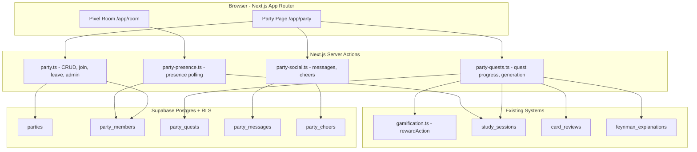
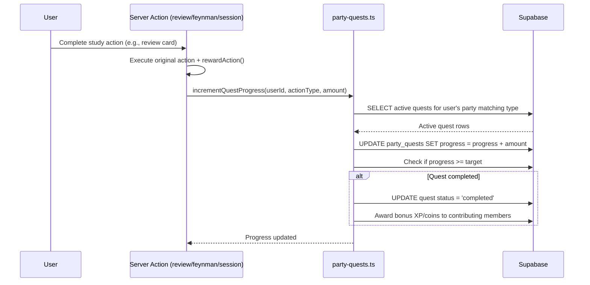
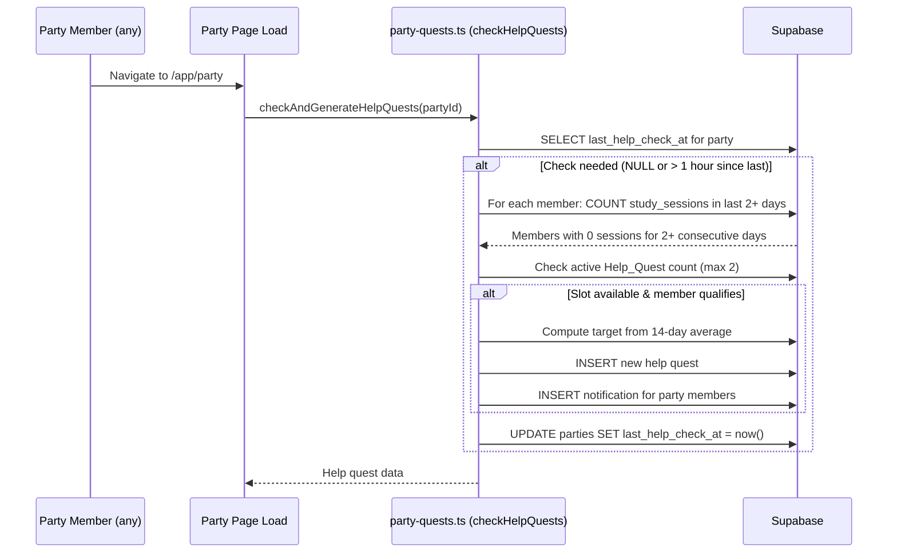

# Design Document: Social Parties

## Overview

Social Parties adds cooperative study groups (3–5 members) to Pixel Study OS. Parties share weekly quests, exchange cheers, post short messages, and trigger collaborative "help me" quests when a member falls behind. The system integrates with existing gamification (XP/coins via `rewardAction`), study sessions, card reviews, and Feynman explanations to track contributions toward shared goals.

### Key Design Decisions

1. **Polling over real-time**: Presence and notifications use best-effort polling (60s) rather than Supabase Realtime subscriptions — simpler infrastructure, acceptable latency for a study app.
2. **Server actions for all mutations**: Follows the existing pattern (`gamification.ts`, `feynman.ts`) — all writes go through `"use server"` actions with auth checks.
3. **RLS for cross-party isolation**: All party tables use Row Level Security policies keyed on party membership, preventing data leakage between parties.
4. **Weekly cycle from owner's timezone**: Cycle boundaries are computed and stored as explicit UTC timestamps derived from the party owner's configured timezone.
5. **Help quest generation on page load**: Instead of a cron job (extra infrastructure), help quest eligibility is evaluated when any party member loads the party page. A `last_help_check_at` column prevents redundant checks within the same hour.

---

## Architecture



### Data Flow: Quest Progress Tracking



### Data Flow: Help Quest Triggering



---

## Components and Interfaces

### Route Structure

```
src/app/(protected)/app/party/
├── page.tsx                    # Server component — fetches party state, renders appropriate view
├── _components/
│   ├── party-page.tsx          # Main party view (members, quests, messages, cheers)
│   ├── party-discovery.tsx     # Public party browser + create party form
│   ├── party-members.tsx       # Member list with avatars, presence dots
│   ├── party-quests.tsx        # Active quest progress bars (regular + help)
│   ├── party-messages.tsx      # Message feed + input
│   ├── party-cheers.tsx        # Cheer buttons + weekly totals
│   ├── party-admin.tsx         # Owner settings panel
│   ├── join-party-dialog.tsx   # Invite code input dialog
│   └── create-party-form.tsx   # Party creation form
```

### Server Actions

```
src/app/(protected)/app/_actions/
├── party.ts                    # createParty, joinParty, leaveParty, getPartyState, discoverParties
├── party-quests.ts             # incrementQuestProgress, checkAndGenerateHelpQuests, getActiveQuests
├── party-social.ts             # sendMessage, sendCheer, getMessages, getCheers
├── party-admin.ts              # updatePartySettings, removeMember, regenerateInvite, disbandParty
└── party-presence.ts           # getPartyPresence (returns studying members)
```

### Key Server Action Interfaces

```typescript
// party.ts
interface CreatePartyInput {
  name: string;           // 3-30 chars, alphanumeric + space/hyphen/underscore
  visibility: "public" | "private";
}

interface PartyState {
  party: Party | null;
  members: PartyMemberView[];
  quests: PartyQuestView[];
  helpQuests: PartyQuestView[];
  recentMessages: PartyMessageView[];
  cheerTotals: Record<string, number>; // userId -> cheer count this cycle
  isOwner: boolean;
  inviteCode?: string; // only for owner of private party
}

interface PartyMemberView {
  userId: string;
  displayName: string;
  avatarThumbnail: string | null;
  joinedAt: string;
  contributionCount: number; // this cycle
  isStudying: boolean;
}

// party-quests.ts
interface PartyQuestView {
  id: string;
  questType: "cards_reviewed" | "feynman_sessions" | "study_minutes";
  target: number;
  progress: number;
  status: "active" | "completed" | "archived";
  isHelpQuest: boolean;
  helpedMemberName?: string;
  cycleEnd: string;
}

// party-social.ts
interface PartyMessageView {
  id: string;
  senderName: string;
  content: string;
  createdAt: string; // ISO timestamp for relative time rendering
}
```

### Component Props

```typescript
// party-page.tsx
interface PartyPageProps {
  state: PartyState;
}

// party-discovery.tsx
interface PartyDiscoveryProps {
  currentParty: { name: string; memberCount: number } | null;
  parties: DiscoverableParty[];
  page: number;
  totalPages: number;
}

interface DiscoverableParty {
  id: string;
  name: string;
  memberCount: number;
  questSummary: { type: string; progress: number; target: number }[];
}
```

---

## Data Models

### New Tables

#### `parties`

| Column | Type | Constraints | Description |
|--------|------|-------------|-------------|
| id | UUID | PK, default `gen_random_uuid()` | Party identifier |
| owner_id | UUID | FK → auth.users, NOT NULL | Party creator |
| name | TEXT | NOT NULL, 3-30 chars | Party display name |
| visibility | TEXT | NOT NULL, CHECK IN ('public', 'private') | Discovery mode |
| invite_code | TEXT | UNIQUE, nullable | 8+ char alphanumeric for private parties |
| invite_code_expires_at | TIMESTAMPTZ | nullable | 7 days from generation |
| timezone | TEXT | NOT NULL, DEFAULT 'UTC' | Owner's timezone for cycle computation |
| cycle_start | TIMESTAMPTZ | NOT NULL | Current weekly cycle start (Monday 00:00 in owner TZ) |
| cycle_end | TIMESTAMPTZ | NOT NULL | Current weekly cycle end (Sunday 23:59 in owner TZ) |
| quest_templates | JSONB | DEFAULT '[]' | Array of {type, target} for auto-generation |
| last_help_check_at | TIMESTAMPTZ | nullable, DEFAULT NULL | Throttle for help quest evaluation; NULL means needs first check |
| deleted_at | TIMESTAMPTZ | nullable | Soft-delete for analytics retention |
| created_at | TIMESTAMPTZ | DEFAULT now() | |
| updated_at | TIMESTAMPTZ | DEFAULT now() | |

#### `party_members`

| Column | Type | Constraints | Description |
|--------|------|-------------|-------------|
| id | UUID | PK, default `gen_random_uuid()` | Row identifier |
| party_id | UUID | FK → parties, NOT NULL | |
| user_id | UUID | FK → auth.users, NOT NULL, UNIQUE | One party per user |
| role | TEXT | NOT NULL, CHECK IN ('owner', 'member') | |
| joined_at | TIMESTAMPTZ | DEFAULT now() | Used for ownership transfer |
| last_seen_at | TIMESTAMPTZ | DEFAULT now() | For presence polling |

**Unique constraint**: `(user_id)` — enforces one party per user.

#### `party_quests`

| Column | Type | Constraints | Description |
|--------|------|-------------|-------------|
| id | UUID | PK, default `gen_random_uuid()` | |
| party_id | UUID | FK → parties, NOT NULL | |
| quest_type | TEXT | NOT NULL, CHECK IN ('cards_reviewed', 'feynman_sessions', 'study_minutes') | |
| target | INTEGER | NOT NULL, CHECK > 0 | Goal value |
| progress | INTEGER | NOT NULL, DEFAULT 0 | Current aggregated value |
| status | TEXT | NOT NULL, DEFAULT 'active', CHECK IN ('active', 'completed', 'archived') | |
| is_help_quest | BOOLEAN | DEFAULT false | |
| helped_user_id | UUID | FK → auth.users, nullable | For help quests |
| cycle_start | TIMESTAMPTZ | NOT NULL | Which cycle this belongs to |
| cycle_end | TIMESTAMPTZ | NOT NULL | |
| created_at | TIMESTAMPTZ | DEFAULT now() | |
| completed_at | TIMESTAMPTZ | nullable | |

#### `party_messages`

| Column | Type | Constraints | Description |
|--------|------|-------------|-------------|
| id | UUID | PK, default `gen_random_uuid()` | |
| party_id | UUID | FK → parties, NOT NULL | |
| sender_id | UUID | FK → auth.users, NOT NULL | |
| content | TEXT | NOT NULL, 1-200 chars | |
| created_at | TIMESTAMPTZ | DEFAULT now() | |

#### `party_cheers`

| Column | Type | Constraints | Description |
|--------|------|-------------|-------------|
| id | UUID | PK, default `gen_random_uuid()` | |
| party_id | UUID | FK → parties, NOT NULL | |
| sender_id | UUID | FK → auth.users, NOT NULL | |
| receiver_id | UUID | FK → auth.users, NOT NULL | |
| emoji | TEXT | NOT NULL, CHECK IN ('fire', 'star', 'clap', 'heart', 'rocket', 'sparkles') | |
| created_at | TIMESTAMPTZ | DEFAULT now() | |

### Indexes

```sql
-- Party lookups
CREATE INDEX idx_parties_visibility ON parties (visibility, deleted_at) WHERE deleted_at IS NULL;
CREATE INDEX idx_parties_invite_code ON parties (invite_code) WHERE invite_code IS NOT NULL;

-- Member lookups
CREATE INDEX idx_party_members_party ON party_members (party_id);
CREATE INDEX idx_party_members_user ON party_members (user_id);

-- Quest lookups
CREATE INDEX idx_party_quests_party_status ON party_quests (party_id, status);
CREATE INDEX idx_party_quests_cycle ON party_quests (party_id, cycle_start, cycle_end);

-- Message feed (newest first)
CREATE INDEX idx_party_messages_party_created ON party_messages (party_id, created_at DESC);

-- Cheer rate limiting & totals
CREATE INDEX idx_party_cheers_sender_date ON party_cheers (sender_id, created_at);
CREATE INDEX idx_party_cheers_receiver_party ON party_cheers (receiver_id, party_id, created_at);
```

### RLS Policies

```sql
-- parties: members can read their own party, public parties visible for discovery
ALTER TABLE parties ENABLE ROW LEVEL SECURITY;

CREATE POLICY "Members can view own party"
  ON parties FOR SELECT
  USING (
    deleted_at IS NULL AND (
      id IN (SELECT party_id FROM party_members WHERE user_id = auth.uid())
      OR visibility = 'public'
    )
  );

CREATE POLICY "Authenticated users can create parties"
  ON parties FOR INSERT
  WITH CHECK (owner_id = auth.uid());

CREATE POLICY "Owner can update own party"
  ON parties FOR UPDATE
  USING (owner_id = auth.uid());

-- party_members: members can see co-members
ALTER TABLE party_members ENABLE ROW LEVEL SECURITY;

CREATE POLICY "Members can view party members"
  ON party_members FOR SELECT
  USING (
    party_id IN (SELECT party_id FROM party_members WHERE user_id = auth.uid())
  );

CREATE POLICY "System inserts members via server actions"
  ON party_members FOR INSERT
  WITH CHECK (user_id = auth.uid());

CREATE POLICY "Users can delete own membership"
  ON party_members FOR DELETE
  USING (user_id = auth.uid());

CREATE POLICY "Owner can remove members"
  ON party_members FOR DELETE
  USING (
    party_id IN (
      SELECT id FROM parties
      WHERE owner_id = auth.uid()
    )
  );

-- party_quests: accessible to party members only
ALTER TABLE party_quests ENABLE ROW LEVEL SECURITY;

CREATE POLICY "Members can view party quests"
  ON party_quests FOR SELECT
  USING (
    party_id IN (SELECT party_id FROM party_members WHERE user_id = auth.uid())
  );

CREATE POLICY "Members can update quest progress"
  ON party_quests FOR UPDATE
  USING (
    party_id IN (SELECT party_id FROM party_members WHERE user_id = auth.uid())
  );

-- party_messages: accessible to party members only
ALTER TABLE party_messages ENABLE ROW LEVEL SECURITY;

CREATE POLICY "Members can view party messages"
  ON party_messages FOR SELECT
  USING (
    party_id IN (SELECT party_id FROM party_members WHERE user_id = auth.uid())
  );

CREATE POLICY "Members can insert messages"
  ON party_messages FOR INSERT
  WITH CHECK (
    sender_id = auth.uid() AND
    party_id IN (SELECT party_id FROM party_members WHERE user_id = auth.uid())
  );

-- party_cheers: accessible to party members only
ALTER TABLE party_cheers ENABLE ROW LEVEL SECURITY;

CREATE POLICY "Members can view party cheers"
  ON party_cheers FOR SELECT
  USING (
    party_id IN (SELECT party_id FROM party_members WHERE user_id = auth.uid())
  );

CREATE POLICY "Members can insert cheers"
  ON party_cheers FOR INSERT
  WITH CHECK (
    sender_id = auth.uid() AND
    party_id IN (SELECT party_id FROM party_members WHERE user_id = auth.uid())
  );
```

### Integration Points with Existing Systems

1. **Gamification** (`rewardAction`): Extended with a new action type `"party_quest_complete"` awarding 50 XP + 25 coins per completed quest. Help quest contributors get 10 XP per contributed session.

2. **Study Sessions** (`study_sessions`): Quest progress for `study_minutes` type reads `duration_minutes` from completed sessions. Presence is derived from active sessions (started but not ended).

3. **Card Reviews** (`card_reviews`): Quest progress for `cards_reviewed` increments by 1 per review. Counted via a join on `card_reviews.user_id` matching party members during the active cycle.

4. **Feynman Explanations** (`feynman_explanations`): Quest progress for `feynman_sessions` increments by 1 per saved explanation. Counted via `feynman_explanations.created_at` within the cycle window.

5. **Profiles** (`profiles`): `timezone` field used as the party timezone when creating a party. `display_name` shown in member lists and messages.

6. **Avatars** (`avatars`): Used to render 32×32 thumbnails on the party page and 16×16 presence indicators in the Pixel Room.

7. **Presence scoping**: `getPartyPresence` determines "studying" status from `study_sessions` (has a row with `ended_at IS NULL` and `started_at` within the last 2 hours). The `last_seen_at` field in `party_members` is updated only when the user loads `/app/room` or `/app/party` — not on every request — to avoid inflating online status.


---

## Correctness Properties

*A property is a characteristic or behavior that should hold true across all valid executions of a system — essentially, a formal statement about what the system should do. Properties serve as the bridge between human-readable specifications and machine-verifiable correctness guarantees.*

### Property 1: Party name validation accepts valid names and rejects invalid ones

*For any* string `s`, `validatePartyName(s)` returns valid if and only if `s` has length 3–30 (inclusive) and contains only alphanumeric characters, spaces, hyphens, and underscores. All other strings are rejected with an appropriate error.

**Validates: Requirements 1.2, 1.3**

### Property 2: One party per user invariant

*For any* user who is already a member of a party, any attempt to create a new party or join another party SHALL be rejected with an error indicating they must leave their current party first.

**Validates: Requirements 1.4, 1.5, 1.7, 2.4**

### Property 3: Private party invite code format

*For any* newly created private party, the generated invite code SHALL be a non-empty string of at least 8 characters composed exclusively of alphanumeric characters (a-z, A-Z, 0-9).

**Validates: Requirements 1.6**

### Property 4: Invite code join validity

*For any* invite code and user not currently in a party, `joinParty(code)` succeeds if and only if the code matches an existing party, is not expired (within 7 days of generation), and the party has fewer than 5 members. Otherwise the request is rejected with an appropriate error.

**Validates: Requirements 2.1, 2.3, 2.6**

### Property 5: Party capacity ceiling

*For any* party, the count of party members SHALL never exceed 5. Any join attempt that would cause the count to exceed 5 is rejected.

**Validates: Requirements 2.3**

### Property 6: Ownership transfer on owner departure

*For any* party with the owner plus N (≥1) remaining members, when the owner leaves, the new owner SHALL be the remaining member with the earliest `joined_at` timestamp. If two or more members share the same earliest timestamp, the one with the alphanumerically-first `user_id` is selected.

**Validates: Requirements 3.2**

### Property 7: Contributions preserved after member departure

*For any* party with active quests containing contributions from a departing member, after that member leaves (voluntarily or is removed by owner), the quest progress values SHALL remain unchanged.

**Validates: Requirements 3.4, 12.2**

### Property 8: Discovery returns only eligible public parties

*For any* set of parties in the system, `discoverParties(page)` SHALL return only parties where `visibility = 'public'`, `deleted_at IS NULL`, and member count < 5, sorted by `created_at` DESC, with at most 20 results per page.

**Validates: Requirements 4.1, 4.3**

### Property 9: Discovery result data completeness

*For any* discoverable party returned by the discovery endpoint, the view SHALL include the party name, current member count, and a quest summary (type + progress/target for up to 3 active quests).

**Validates: Requirements 4.2**

### Property 10: Quest generation from templates

*For any* party with N configured quest templates (1 ≤ N ≤ 3) when a new weekly cycle begins, the system SHALL generate exactly N quests matching the template types and targets within the allowed ranges (cards_reviewed: 10-1000, feynman_sessions: 5-200, study_minutes: 30-5000).

**Validates: Requirements 5.1, 5.2**

### Property 11: Quest progress increment correctness

*For any* study action completed by a party member where a matching active quest exists, the quest progress SHALL increment by exactly: 1 per card review, 1 per Feynman session, or actual minutes per study session. No other quest types are affected.

**Validates: Requirements 5.3**

### Property 12: Quest completion awards correct bonus

*For any* party quest that reaches its target value, each party member who contributed at least 1 unit SHALL receive exactly 50 XP and 25 coins. Members with zero contributions receive nothing.

**Validates: Requirements 5.5**

### Property 13: Expired quests incur no penalty

*For any* party quest that is archived (either regular quest at cycle end or help quest after 7 days without completion), no party member's XP or coins SHALL decrease as a result of the archival.

**Validates: Requirements 5.6, 6.8**

### Property 14: Help quest generation trigger

*For any* party member with zero study sessions for 2 or more consecutive calendar days (evaluated in party timezone), and their party has fewer than 2 active help quests, the system SHALL generate a help quest.

**Validates: Requirements 6.1, 6.5**

### Property 15: Help quest target calculation

*For any* party member qualifying for a help quest with N active days of session history (up to 14) and M missed days, the help quest target SHALL equal `max(1, ceil(totalSessions / N) * M)`. If the member has fewer than 14 active days, all available active days are used.

**Validates: Requirements 6.2**

### Property 16: Help quest idempotence

*For any* party member who already has an active help quest, re-evaluating help quest generation SHALL not create a duplicate quest. The active help quest count for a party SHALL never exceed 2.

**Validates: Requirements 6.5, 6.6**

### Property 17: Cheer delivery and self-cheer rejection

*For any* party member sending a cheer to another member in the same party with a valid emoji, the cheer SHALL be stored. If the sender equals the receiver, the request SHALL be rejected.

**Validates: Requirements 7.1, 7.7**

### Property 18: Cheer emoji validation

*For any* emoji string, `sendCheer` SHALL accept only values in the set {'fire', 'star', 'clap', 'heart', 'rocket', 'sparkles'} and reject all other values.

**Validates: Requirements 7.2**

### Property 19: Cheer daily rate limit

*For any* sender who has sent 10 cheers on the current calendar day (in party timezone), any further cheer attempt on that day SHALL be rejected with a rate limit error.

**Validates: Requirements 7.3, 7.4**

### Property 20: Cheer weekly totals accuracy

*For any* party member and the current weekly cycle, the reported cheer total SHALL equal the exact count of `party_cheers` rows where `receiver_id` matches that member and `created_at` falls within the cycle boundaries.

**Validates: Requirements 7.6**

### Property 21: Message validation

*For any* string submitted as a party message, the system SHALL accept it if and only if it contains at least 1 non-whitespace character, is at most 200 characters in length, and does not contain any word from the server-side blocklist. All other submissions are rejected.

**Validates: Requirements 8.2, 8.7**

### Property 22: Message ordering and limit

*For any* party with N messages, `getMessages` SHALL return at most 20 messages sorted by `created_at` descending (newest first).

**Validates: Requirements 8.3**

### Property 23: Message daily rate limit

*For any* party member who has sent 20 messages on the current calendar day (in party timezone), any further message submission SHALL be rejected.

**Validates: Requirements 8.5, 8.6**

### Property 24: Presence reflects active study sessions

*For any* party member with an active study session (started_at set, ended_at NULL, not timed out), `getPartyPresence` SHALL include that member as "studying". Members without active sessions SHALL not appear.

**Validates: Requirements 10.1**

### Property 25: Presence limited to 4, ordered by recency

*For any* party where more than 4 members are studying simultaneously, `getPartyPresence` SHALL return exactly 4 members, ordered by `started_at` DESC (most recently started first).

**Validates: Requirements 10.4**

### Property 26: Party data isolation via RLS

*For any* user who is NOT a current member of a given party, queries to that party's quests, messages, and cheers SHALL return zero rows. Access attempts via server actions SHALL return an error.

**Validates: Requirements 11.1, 11.2, 11.4, 11.6**

### Property 27: Invite code expiration and reuse

*For any* invite code, join attempts SHALL fail if the code is older than 7 days from generation. For any user who previously joined a party using a specific code and then left, re-using the same code SHALL be rejected.

**Validates: Requirements 11.5**

### Property 28: Invite code regeneration invalidates previous

*For any* party where the owner regenerates the invite code, the previous code SHALL no longer be valid for joining, and the new code SHALL be alphanumeric, 8+ characters, with a fresh 7-day expiry.

**Validates: Requirements 12.3**

### Property 29: Admin actions restricted to owner

*For any* party member who is NOT the owner, attempting updateSettings, removeMember, regenerateInvite, or disbandParty SHALL be rejected with a permissions error.

**Validates: Requirements 12.4**

---

## Error Handling

### Validation Errors (Client-Preventable)

| Error | Trigger | Response |
|-------|---------|----------|
| `INVALID_PARTY_NAME` | Name outside 3-30 chars or invalid characters | Return specific validation rule violated |
| `INVALID_MESSAGE` | Empty/whitespace-only or > 200 chars | "Message must be 1-200 characters" |
| `INVALID_EMOJI` | Emoji not in allowed set | "Invalid cheer emoji" |
| `CONTENT_BLOCKED` | Message contains blocklist word | "Message not posted due to content restrictions" |

### Business Rule Errors

| Error | Trigger | Response |
|-------|---------|----------|
| `ALREADY_IN_PARTY` | User tries to create/join while in a party | "You must leave your current party first" |
| `PARTY_FULL` | Join attempt on party with 5 members | "This party is full" |
| `INVITE_EXPIRED` | Code older than 7 days | "Invite code is invalid or expired" |
| `INVITE_INVALID` | Code doesn't match any party | "Invite code is invalid or expired" |
| `INVITE_REUSE` | User previously used this code | "Invite code is invalid or expired" |
| `RATE_LIMITED_CHEER` | > 10 cheers/day | "Daily cheer limit reached" |
| `RATE_LIMITED_MESSAGE` | > 20 messages/day | "Daily message limit reached" |
| `SELF_CHEER` | Sender = receiver | "Cannot cheer yourself" |
| `NOT_OWNER` | Non-owner attempts admin action | "Insufficient permissions" |
| `QUEST_TARGET_OUT_OF_RANGE` | Target outside allowed range for type | "Target must be between X and Y" |

### System Errors

| Error | Trigger | Response |
|-------|---------|----------|
| `NOT_AUTHENTICATED` | No valid session | "Not authenticated" (redirect to login) |
| `PROFILE_NOT_FOUND` | Missing profile row | "Profile not found" |
| `PARTY_NOT_FOUND` | Party deleted or doesn't exist | "Party not found" |
| `DB_ERROR` | Supabase query failure | Log error server-side, return generic "Something went wrong" |

### Error Handling Strategy

- **Server actions** return `{ data?: T; error?: string }` consistent with existing patterns (`gamification.ts`, `feynman.ts`).
- **Validation** runs before any DB writes — fail fast with specific messages.
- **RLS violations** surface as empty results (SELECT) or constraint errors (INSERT/UPDATE) — caught and translated to user-friendly messages.
- **Rate limit checks** query count of today's records before allowing the operation — no external rate-limit service needed.
- **Blocklist filtering** uses a simple word-boundary regex against a server-side array of blocked terms. Case-insensitive matching. No external API calls.

---

## Testing Strategy

### Property-Based Tests (PBT)

**Library**: [fast-check](https://github.com/dubzzz/fast-check) (TypeScript, well-maintained, integrates with Vitest)

**Configuration**: Minimum 100 iterations per property test.

**Tag format**: `// Feature: social-parties, Property {N}: {title}`

Each correctness property above maps to a single property-based test. Key generators needed:

1. **Party name generator**: Random strings of varying length and charset (valid + invalid)
2. **Invite code generator**: Alphanumeric strings of varying length
3. **Party state generator**: Parties with 1-5 members, various quest configurations
4. **Message content generator**: Strings of 0-300 chars including whitespace-only, blocklist words, and valid content
5. **Emoji generator**: Strings from the valid set + arbitrary strings
6. **Study activity generator**: Arrays of study sessions with timestamps across date boundaries
7. **Quest template generator**: {type, target} objects with in-range and out-of-range values

### Unit Tests (Example-Based)

Focus on:
- Specific integration scenarios (join notification creation, help quest notification)
- UI conditional rendering (non-member sees discovery, empty states)
- Ownership transfer tiebreaker with exact timestamps
- Party disband cascade effects
- Cycle boundary computation for various timezones

### Integration Tests

- End-to-end party lifecycle: create → join → quest progress → complete → leave
- RLS enforcement: user A cannot read user B's party data
- Help quest generation with real study_sessions data
- Presence polling with active/ended sessions
- Gamification integration: verify `rewardAction` called with correct parameters on quest completion

### Test File Structure

```
src/__tests__/
├── party/
│   ├── party.property.test.ts       # Properties 1-9 (CRUD, membership)
│   ├── party-quests.property.test.ts # Properties 10-16 (quest logic)
│   ├── party-social.property.test.ts # Properties 17-23 (cheers, messages)
│   ├── party-presence.property.test.ts # Properties 24-25 (presence)
│   ├── party-security.property.test.ts # Properties 26-29 (RLS, auth)
│   ├── party.unit.test.ts           # Example-based unit tests
│   └── party.integration.test.ts    # End-to-end with Supabase
```
