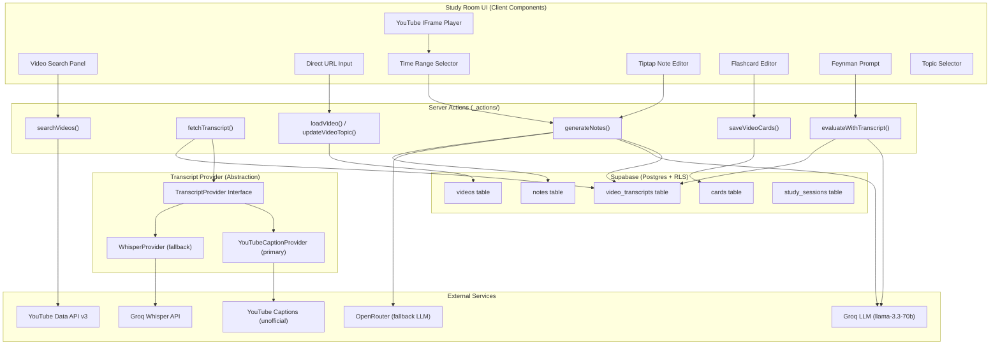
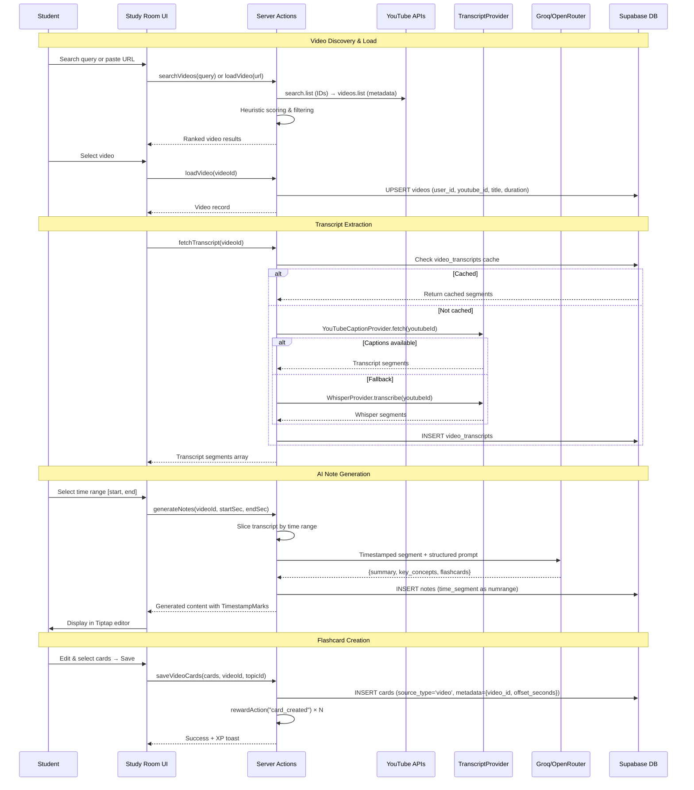
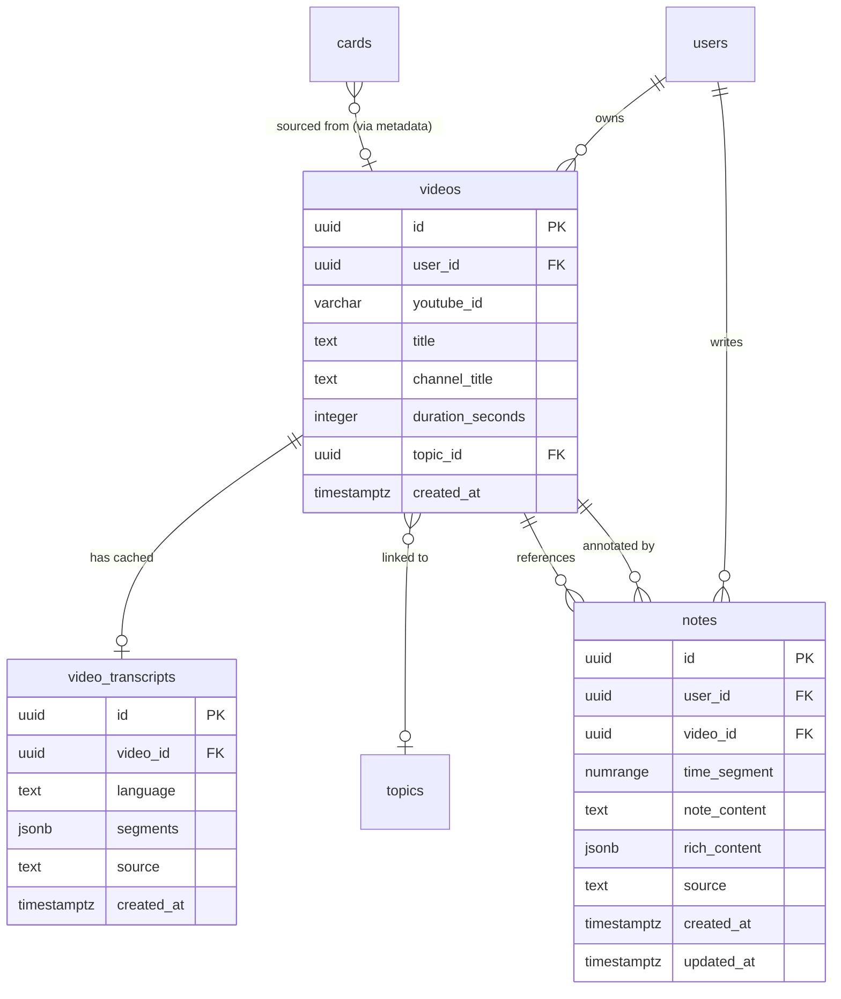

# Design Document: Study Room

## Overview

The Study Room is a unified video study workspace at `/app/study-room` that transforms passive YouTube watching into active, structured learning. It combines a programmatically-controlled YouTube player with a Tiptap-based rich text editor featuring custom timestamp marks, AI-powered note generation from transcript segments, Feynman technique integration, and flashcard creation — all linked back to source video timestamps.

The feature integrates with the existing gamification system (XP, coins, pet affinity) and SM-2 spaced repetition engine through the established `rewardAction()` pattern.

### Key Design Decisions

| Decision | Rationale |
|----------|-----------|
| TranscriptProvider interface abstracting caption retrieval | Allows swapping the unofficial `youtube-transcript-plus` for an official or self-hosted solution without rewriting the Study Room feature |
| Two-step video search (search.list → videos.list → heuristic scoring) | YouTube Data API v3 search.list returns minimal metadata; videos.list provides duration/stats needed for educational filtering |
| Per-user transcript storage (via user-scoped `videos` rows) | RLS-compatible; avoids global deduplication complexity; each user's cache is isolated |
| PostgreSQL `numrange` + GiST index for time segments | Native range containment/overlap queries (`@>`, `&&`); type-level enforcement of valid intervals |
| Tiptap with custom `TimestampMark` | Headless, React 19-compatible, MIT-licensed; inline marks render clickable timestamp badges that seek the player |
| YouTube IFrame API (client component) | Official embed method compliant with YouTube ToS; provides programmatic `seekTo`/`pause`/`play`/`getCurrentTime` |
| Server actions for all backend logic | Matches existing `_actions/` pattern; no Edge Functions needed |
| Groq primary / OpenRouter fallback for LLM | Matches existing pattern in `feynman.ts` and `research.ts`; Groq is fast (~2s), OpenRouter is the free fallback |
| `youtube-transcript-plus` primary / Groq Whisper fallback | Zero-dependency TypeScript lib for caption extraction; Whisper handles videos without captions |

## Architecture



### Data Flow: Search → Play → Transcript → Notes → Cards



## Components and Interfaces

### Server Action Files

#### `_actions/study-room.ts` — New file (primary Study Room logic)

```typescript
"use server";

// === Interfaces ===

interface VideoSearchResult {
  youtubeId: string;
  title: string;
  channelTitle: string;
  durationSeconds: number;
  thumbnailUrl: string;
  viewCount: number;
  relevanceScore: number;
}

interface TranscriptSegment {
  text: string;
  offset: number;    // start time in seconds
  duration: number;  // segment duration in seconds
}

interface GeneratedNotes {
  summary: string;
  keyConcepts: {
    concept: string;
    definition: string;
    timestampCitation: string;  // formatted MM:SS
    offsetSeconds: number;
  }[];
  flashcards: {
    front: string;
    back: string;
    offsetSeconds: number;
  }[];
}

interface VideoRecord {
  id: string;
  userId: string;
  youtubeId: string;
  title: string;
  channelTitle: string | null;
  durationSeconds: number;
  topicId: string | null;
  createdAt: string;
}

interface NoteRecord {
  id: string;
  videoId: string;
  timeSegment: { start: number; end: number };
  noteContent: string;
  richContent: object | null;  // Tiptap JSON
  source: "manual" | "ai";
  createdAt: string;
  updatedAt: string;
}

// === Exported Server Actions ===

export async function searchVideos(query: string): Promise<{
  data?: VideoSearchResult[];
  error?: string;
}>;

export async function loadVideo(youtubeIdOrUrl: string): Promise<{
  data?: VideoRecord;
  error?: string;
}>;

export async function fetchTranscript(videoId: string): Promise<{
  data?: TranscriptSegment[];
  error?: string;
  source?: "youtube" | "whisper";
}>;

export async function generateNotes(
  videoId: string,
  startSeconds: number,
  endSeconds: number
): Promise<{
  data?: GeneratedNotes;
  error?: string;
}>;

export async function saveVideoCards(
  cards: { front: string; back: string; offsetSeconds: number }[],
  videoId: string,
  topicId?: string
): Promise<{ success?: boolean; count?: number; error?: string }>;

export async function evaluateWithTranscript(
  videoId: string,
  explanation: string,
  startSeconds: number,
  endSeconds: number,
  topicId?: string
): Promise<{ data?: GapAnalysis; error?: string }>;

export async function saveNote(
  videoId: string,
  timeSegment: { start: number; end: number },
  noteContent: string,
  richContent?: object
): Promise<{ data?: NoteRecord; error?: string }>;

export async function getVideoNotes(videoId: string): Promise<{
  data?: NoteRecord[];
  error?: string;
}>;

export async function updateVideoTopic(
  videoId: string,
  topicId: string | null
): Promise<{ success?: boolean; error?: string }>;
```

#### `_actions/study-room/transcript-provider.ts` — TranscriptProvider interface

```typescript
// === TranscriptProvider Interface ===

export interface TranscriptProvider {
  name: string;
  fetch(youtubeId: string): Promise<TranscriptSegment[]>;
}

// === YouTubeCaptionProvider (primary) ===
// Uses youtube-transcript-plus to extract captions via YouTube's InnerTube API
export class YouTubeCaptionProvider implements TranscriptProvider {
  name = "youtube";
  async fetch(youtubeId: string): Promise<TranscriptSegment[]> {
    // 1. Call youtube-transcript-plus fetchTranscript(youtubeId)
    // 2. Map response to TranscriptSegment[] (text, offset, duration)
    // 3. Throw on failure (triggers fallback)
  }
}

// === WhisperProvider (fallback) ===
// Downloads audio stream and transcribes via Groq Whisper API
export class WhisperProvider implements TranscriptProvider {
  name = "whisper";
  async fetch(youtubeId: string): Promise<TranscriptSegment[]> {
    // 1. Get audio stream URL (ytdl-core or similar)
    // 2. Send to Groq Whisper API with timestamps
    // 3. Parse Whisper response into TranscriptSegment[]
    // Note: Higher latency, consumes Groq quota
  }
}

// === Orchestrator ===
export async function getTranscript(youtubeId: string): Promise<{
  segments: TranscriptSegment[];
  source: "youtube" | "whisper";
}> {
  const providers: TranscriptProvider[] = [
    new YouTubeCaptionProvider(),
    new WhisperProvider(),
  ];
  
  for (const provider of providers) {
    try {
      const segments = await provider.fetch(youtubeId);
      return { segments, source: provider.name as "youtube" | "whisper" };
    } catch (err) {
      console.warn(`${provider.name} failed:`, err);
      continue;
    }
  }
  
  throw new Error("All transcript providers failed");
}
```

#### `_actions/study-room/search-heuristic.ts` — Video scoring algorithm

```typescript
/**
 * Heuristic scoring for educational video relevance.
 * Applied server-side after videos.list returns full metadata.
 *
 * Score = w1 * ln(views) + w2 * (likes/views) - w3 * clickbaitFactor
 *
 * Exclusion criteria (score = -1, filtered out):
 * - Duration < 240s (under 4 minutes)
 * - Title contains: vlog, parody, funny, gaming, shorts, prank, reaction
 * - Channel is in a known entertainment blocklist
 */
export function scoreVideo(metadata: {
  title: string;
  description: string;
  durationSeconds: number;
  viewCount: number;
  likeCount: number;
  channelTitle: string;
}): number;

export function filterAndRankVideos(
  videos: YouTubeVideoMetadata[],
  maxResults?: number  // default 10
): VideoSearchResult[];
```

### Client Components

#### New Components (in `study-room/_components/`)

| Component | Responsibility |
|-----------|---------------|
| `youtube-player.tsx` | Client component wrapping YouTube IFrame API; exposes `seekTo`, `pause`, `play`, `getCurrentTime`; reports time via callback every 500ms |
| `video-search.tsx` | Search input with debounce + results grid (thumbnails, titles, durations) |
| `url-input.tsx` | Direct YouTube URL paste input with regex validation |
| `time-range-selector.tsx` | MM:SS / HH:MM:SS inputs for start/end with video duration bounds validation |
| `note-editor.tsx` | Tiptap editor with markdown formatting + TimestampMark support + auto-save |
| `timestamp-mark.tsx` | Custom Tiptap Mark extension: clickable `[MM:SS]` badges that call `seekTo` |
| `generated-notes.tsx` | Displays AI-generated summary, key concepts, flashcards with timestamp links |
| `video-card-editor.tsx` | Edit/select/reject individual flashcards before saving (reuses pattern from Feynman editor) |
| `feynman-video-prompt.tsx` | "Explain what you watched" prompt with 60s cooldown timer |
| `topic-linker.tsx` | Dropdown to associate video with existing Topic |
| `xp-toast.tsx` | Reuses existing floating XP notification component |
| `study-room-layout.tsx` | Split-panel responsive layout (60/40 desktop, stacked mobile) |

### Tiptap TimestampMark Extension (Low-Level Design)

```typescript
import { Mark, mergeAttributes } from '@tiptap/core';

export const TimestampMark = Mark.create({
  name: 'timestamp',

  addOptions() {
    return {
      HTMLAttributes: {
        class: 'timestamp-mark inline-flex items-center px-1.5 py-0.5 rounded bg-indigo-100 text-indigo-700 text-xs font-mono cursor-pointer hover:bg-indigo-200 transition-colors',
      },
      onSeek: (seconds: number) => {},  // Injected by parent
    };
  },

  addAttributes() {
    return {
      seconds: {
        default: 0,
        parseHTML: (el) => parseFloat(el.getAttribute('data-seconds') || '0'),
        renderHTML: (attrs) => ({ 'data-seconds': attrs.seconds }),
      },
    };
  },

  parseHTML() {
    return [{ tag: 'span[data-seconds]' }];
  },

  renderHTML({ HTMLAttributes }) {
    return ['span', mergeAttributes(this.options.HTMLAttributes, HTMLAttributes), 0];
  },

  addKeyboardShortcuts() {
    return {
      'Mod-Shift-t': () => {
        // Insert timestamp at current cursor position
        // The seconds value is injected from the player's getCurrentTime()
        return this.editor.commands.toggleMark(this.name);
      },
    };
  },
});
```

### YouTube Player Component (Low-Level Design)

```typescript
"use client";

interface YouTubePlayerProps {
  videoId: string;
  onReady?: (controller: PlayerController) => void;
  onTimeUpdate?: (seconds: number) => void;
  onStateChange?: (state: "playing" | "paused" | "ended") => void;
}

interface PlayerController {
  seekTo: (seconds: number) => void;
  pause: () => void;
  play: () => void;
  getCurrentTime: () => number;
  getDuration: () => number;
}

// Implementation:
// - Loads YouTube IFrame API script dynamically (once)
// - Creates YT.Player instance in a div ref
// - setInterval at 500ms for time reporting while playing
// - Exposes PlayerController via onReady callback
// - Cleans up interval and player instance on unmount
```

### Search Algorithm (Low-Level Design)

```typescript
/**
 * Two-step video search pipeline:
 *
 * Step 1: search.list
 *   - q: userQuery + " -vlog -parody -funny -gaming -shorts"
 *   - type: "video"
 *   - videoCategoryId: "27" (Education) — fallback to "28" if no results
 *   - videoDuration: "medium" or "long"
 *   - maxResults: 20 (fetch extra for filtering)
 *   - order: "relevance"
 *   - safeSearch: "strict"
 *   Returns: videoId list
 *
 * Step 2: videos.list
 *   - id: comma-separated videoIds from step 1
 *   - part: "snippet,contentDetails,statistics"
 *   Returns: full metadata (title, channel, duration ISO 8601, views, likes)
 *
 * Step 3: Server-side heuristic scoring
 *   - Parse ISO 8601 duration → seconds
 *   - Filter: exclude < 240s, exclude clickbait titles
 *   - Score remaining videos
 *   - Sort descending, take top 10
 *   - Return VideoSearchResult[]
 */
```

### Transcript Slicing Algorithm (Low-Level Design)

```typescript
/**
 * sliceTranscript(segments, startSeconds, endSeconds):
 *
 * Given a full transcript as TranscriptSegment[], returns only segments
 * whose offset falls within [startSeconds, endSeconds).
 *
 * Algorithm:
 *   1. Filter: segment.offset >= startSeconds AND segment.offset < endSeconds
 *   2. Sort by offset ascending (should already be sorted)
 *   3. If result is empty, return empty array (caller handles this)
 *
 * Time format conversion helpers:
 *   - parseTimeInput("04:22") → 262 seconds
 *   - parseTimeInput("1:04:22") → 3862 seconds
 *   - formatSeconds(262) → "04:22"
 *   - formatSeconds(3862) → "1:04:22"
 */
export function sliceTranscript(
  segments: TranscriptSegment[],
  startSeconds: number,
  endSeconds: number
): TranscriptSegment[];

export function parseTimeInput(input: string): number | null;
export function formatSeconds(seconds: number): string;
```

### LLM Prompt for Note Generation (Low-Level Design)

```
SYSTEM:
You are an expert academic tutor. Analyze the provided timestamped transcript segment from the video "{videoTitle}" (segment: {startFormatted} to {endFormatted}).

Generate structured study materials. Your output must be a single, valid JSON object:

{
  "summary": "A concise academic summary of the segment (100-200 words).",
  "key_concepts": [
    {
      "concept": "Name of the concept",
      "definition": "Detailed explanation grounded in the segment.",
      "timestamp_citation": "MM:SS",
      "offset_seconds": <number>
    }
  ],
  "flashcards": [
    {
      "question": "An active-recall question testing a core concept.",
      "answer": "A precise, evidence-backed answer.",
      "offset_seconds": <number>
    }
  ]
}

Rules:
- Ground all content in the transcript text provided
- Timestamp citations must reference actual offsets from the segment
- Generate 3-7 key concepts and 3-5 flashcards
- Questions should test understanding, not just recall
- Keep summary factual and dense with information

USER:
[TRANSCRIPT SEGMENT: {startFormatted} to {endFormatted}]
{formattedSegments}
[END SEGMENT]
```

## Data Models

### Schema Migration: `004_study_room.sql`

```sql
-- ============================================================
-- Study Room Schema (Phase 14)
-- Videos, transcripts, and timestamped notes
-- ============================================================

-- Enable btree_gist for numrange + GiST indexing
CREATE EXTENSION IF NOT EXISTS btree_gist;

-- ============================================================
-- 1. VIDEOS (user-scoped video records)
-- ============================================================
CREATE TABLE videos (
  id UUID PRIMARY KEY DEFAULT gen_random_uuid(),
  user_id UUID NOT NULL REFERENCES auth.users(id) ON DELETE CASCADE,
  youtube_id VARCHAR(11) NOT NULL,
  title TEXT NOT NULL,
  channel_title TEXT,
  duration_seconds INTEGER NOT NULL,
  topic_id UUID REFERENCES topics(id) ON DELETE SET NULL,
  created_at TIMESTAMPTZ DEFAULT now(),

  CONSTRAINT videos_user_youtube_unique UNIQUE (user_id, youtube_id)
);

ALTER TABLE videos ENABLE ROW LEVEL SECURITY;

CREATE POLICY "Users can manage own videos"
  ON videos FOR ALL USING (user_id = auth.uid());

-- ============================================================
-- 2. VIDEO_TRANSCRIPTS (cached transcript segments)
-- ============================================================
CREATE TABLE video_transcripts (
  id UUID PRIMARY KEY DEFAULT gen_random_uuid(),
  video_id UUID NOT NULL REFERENCES videos(id) ON DELETE CASCADE,
  language TEXT NOT NULL DEFAULT 'en',
  segments JSONB NOT NULL,  -- Array of {text, offset, duration}
  source TEXT NOT NULL CHECK (source IN ('youtube', 'whisper')),
  created_at TIMESTAMPTZ DEFAULT now(),

  CONSTRAINT video_transcripts_video_language_unique UNIQUE (video_id, language)
);

ALTER TABLE video_transcripts ENABLE ROW LEVEL SECURITY;

-- RLS via parent videos row (JOIN-based policy)
CREATE POLICY "Users can manage transcripts for own videos"
  ON video_transcripts FOR ALL
  USING (
    EXISTS (
      SELECT 1 FROM videos v
      WHERE v.id = video_transcripts.video_id
      AND v.user_id = auth.uid()
    )
  );

-- ============================================================
-- 3. NOTES (timestamped video notes with numrange)
-- ============================================================
CREATE TABLE notes (
  id UUID PRIMARY KEY DEFAULT gen_random_uuid(),
  user_id UUID NOT NULL REFERENCES auth.users(id) ON DELETE CASCADE,
  video_id UUID NOT NULL REFERENCES videos(id) ON DELETE CASCADE,
  time_segment NUMRANGE NOT NULL,  -- [start_seconds, end_seconds)
  note_content TEXT NOT NULL,
  rich_content JSONB,  -- Tiptap document JSON
  source TEXT NOT NULL DEFAULT 'manual' CHECK (source IN ('manual', 'ai')),
  created_at TIMESTAMPTZ DEFAULT now(),
  updated_at TIMESTAMPTZ DEFAULT now()
);

ALTER TABLE notes ENABLE ROW LEVEL SECURITY;

CREATE POLICY "Users can manage own notes"
  ON notes FOR ALL USING (user_id = auth.uid());

-- GiST index for efficient range overlap/containment queries
CREATE INDEX idx_notes_time_segment ON notes USING gist (time_segment);

-- Composite index for fetching notes by video
CREATE INDEX idx_notes_video ON notes (video_id, user_id);

-- ============================================================
-- 4. CARDS TABLE UPDATE (add 'video' source_type + metadata)
-- ============================================================

-- Extend source_type CHECK constraint to include 'video'
ALTER TABLE cards DROP CONSTRAINT IF EXISTS cards_source_type_check;
ALTER TABLE cards ADD CONSTRAINT cards_source_type_check
  CHECK (source_type IN ('feynman', 'research', 'manual', 'video'));

-- Add metadata column for video source info
ALTER TABLE cards ADD COLUMN IF NOT EXISTS metadata JSONB;
-- metadata schema for video cards: {"video_id": "uuid", "offset_seconds": number}

-- ============================================================
-- 5. STUDY_SESSIONS UPDATE (add 'video' mode)
-- ============================================================
ALTER TABLE study_sessions DROP CONSTRAINT IF EXISTS study_sessions_mode_check;
ALTER TABLE study_sessions ADD CONSTRAINT study_sessions_mode_check
  CHECK (mode IN ('feynman', 'review', 'research', 'planner', 'video'));

-- ============================================================
-- 6. INDEXES
-- ============================================================
CREATE INDEX idx_videos_user ON videos (user_id, created_at DESC);
CREATE INDEX idx_videos_youtube ON videos (youtube_id);
CREATE INDEX idx_video_transcripts_video ON video_transcripts (video_id);
```

### Entity Relationship Diagram



### TypeScript Types

```typescript
// TranscriptSegment — core unit of transcript data
interface TranscriptSegment {
  text: string;
  offset: number;    // seconds from video start
  duration: number;  // segment duration in seconds
}

// VideoRecord — mirrors videos table
interface VideoRecord {
  id: string;
  userId: string;
  youtubeId: string;
  title: string;
  channelTitle: string | null;
  durationSeconds: number;
  topicId: string | null;
  createdAt: string;
}

// NoteRecord — mirrors notes table
interface NoteRecord {
  id: string;
  userId: string;
  videoId: string;
  timeSegment: { start: number; end: number };
  noteContent: string;
  richContent: object | null;
  source: "manual" | "ai";
  createdAt: string;
  updatedAt: string;
}

// VideoCard metadata stored in cards.metadata JSONB
interface VideoCardMetadata {
  video_id: string;
  offset_seconds: number;
}

// Search result returned to client
interface VideoSearchResult {
  youtubeId: string;
  title: string;
  channelTitle: string;
  durationSeconds: number;
  thumbnailUrl: string;
  viewCount: number;
  relevanceScore: number;
}
```

### Key SQL Queries

```sql
-- Fetch notes active at a given timestamp (for sidebar highlights)
SELECT id, note_content, lower(time_segment) AS start_sec, upper(time_segment) AS end_sec
FROM notes
WHERE video_id = $1 AND user_id = $2
  AND time_segment @> $3::numeric;

-- Fetch all notes for a video, ordered by time
SELECT * FROM notes
WHERE video_id = $1 AND user_id = $2
ORDER BY lower(time_segment) ASC;

-- Upsert video record (per-user, per youtube_id)
INSERT INTO videos (user_id, youtube_id, title, channel_title, duration_seconds, topic_id)
VALUES ($1, $2, $3, $4, $5, $6)
ON CONFLICT (user_id, youtube_id)
DO UPDATE SET title = EXCLUDED.title, channel_title = EXCLUDED.channel_title
RETURNING *;

-- Check transcript cache
SELECT segments, source FROM video_transcripts
WHERE video_id = $1 AND language = 'en'
LIMIT 1;
```


## Correctness Properties

*A property is a characteristic or behavior that should hold true across all valid executions of a system — essentially, a formal statement about what the system should do. Properties serve as the bridge between human-readable specifications and machine-verifiable correctness guarantees.*

### Property 1: Search query length validation

*For any* string of arbitrary length, the search query validator SHALL accept the input if and only if its trimmed length is between 3 and 200 characters inclusive. Strings outside this range SHALL be rejected with an appropriate error message.

**Validates: Requirements 1.1, 1.7**

### Property 2: Exclusion modifiers always appended to search queries

*For any* valid search query string (3-200 characters), the constructed YouTube API query SHALL contain all exclusion modifiers (`-vlog`, `-parody`, `-funny`, `-gaming`, `-shorts`). The original user query text SHALL also be present in the constructed query.

**Validates: Requirements 1.4**

### Property 3: Duration filter excludes short videos

*For any* set of video metadata objects with random durations (0-86400 seconds), the filtering function SHALL exclude all videos with `durationSeconds < 240` and include only videos with `durationSeconds >= 240`. The output set SHALL be a strict subset of the input set.

**Validates: Requirements 1.3**

### Property 4: YouTube URL video ID extraction

*For any* valid YouTube URL in supported formats (`youtube.com/watch?v=`, `youtu.be/`, `youtube.com/embed/`, `youtube.com/shorts/`), the extraction function SHALL return the 11-character video ID. *For any* string that does not match a supported YouTube URL pattern, the function SHALL return null or an error.

**Validates: Requirements 2.5, 2.6**

### Property 5: Transcript segment parsing produces valid structure

*For any* raw transcript response containing an array of objects with text, offset, and duration fields, the parsing function SHALL produce a `TranscriptSegment[]` where every element has: a non-empty `text` string, a non-negative numeric `offset`, and a positive numeric `duration`.

**Validates: Requirements 3.2**

### Property 6: Transcript cache round-trip preserves data

*For any* valid `TranscriptSegment[]` array, storing it in the `video_transcripts` table (as JSONB) and then retrieving it SHALL produce a segment array where every element's `text`, `offset`, and `duration` values are identical to the original input.

**Validates: Requirements 3.6, 3.7**

### Property 7: Transcript slicing correctness

*For any* `TranscriptSegment[]` array and any time range `[startSeconds, endSeconds)` where `startSeconds < endSeconds`, the slicing function SHALL return only segments where `segment.offset >= startSeconds AND segment.offset < endSeconds`. No segment meeting this criterion SHALL be omitted, and no segment failing it SHALL be included.

**Validates: Requirements 4.1**

### Property 8: Time range validation

*For any* triple `(startSeconds, endSeconds, videoDurationSeconds)` where all values are non-negative numbers, the time range validator SHALL accept the input if and only if `0 <= startSeconds < endSeconds <= videoDurationSeconds`. All other combinations SHALL be rejected.

**Validates: Requirements 4.8**

### Property 9: Note generation prompt completeness

*For any* video title (non-empty string), time range (valid start/end), and sliced transcript (1+ segments), the constructed LLM prompt SHALL contain: the video title, the formatted start time, the formatted end time, and the text content of every transcript segment in the slice.

**Validates: Requirements 4.2, 4.7**

### Property 10: Card field length validation

*For any* card creation attempt, the front field SHALL be accepted if and only if its trimmed length is between 1 and 200 characters inclusive, and the back field SHALL be accepted if and only if its trimmed length is between 1 and 1000 characters inclusive.

**Validates: Requirements 6.2**

### Property 11: Video card metadata invariant

*For any* card saved from the Study Room with a valid `videoId` and `offsetSeconds`, the created card record SHALL have `source_type` equal to `"video"` and a `metadata` JSONB field containing both `video_id` (matching the input videoId) and `offset_seconds` (matching the input offset as a non-negative number).

**Validates: Requirements 6.3, 7.4**

### Property 12: Card creation reward count

*For any* batch of N cards (where N >= 1) saved in a single `saveVideoCards` call, the `rewardAction("card_created")` function SHALL be invoked exactly N times.

**Validates: Requirements 6.6, 9.3**

### Property 13: Topic inheritance for generated cards

*For any* video record with a non-null `topic_id` and any batch of cards generated from that video where the user does not explicitly select a different topic, every saved card SHALL have its `topic_id` set to the video's `topic_id`.

**Validates: Requirements 11.3**

### Property 14: Retry-After header parsing

*For any* HTTP 429 response, the calculated retry wait time SHALL equal the numeric value of the `Retry-After` header (in seconds) when the header is present and parseable as a positive integer. When the header is absent, empty, or not a valid positive integer, the wait time SHALL default to 60 seconds.

**Validates: Requirements 12.4**

### Property 15: Feynman explanation minimum length validation

*For any* string, the Feynman explanation validator SHALL accept the input if and only if its trimmed length is at least 50 characters. Strings with fewer than 50 non-whitespace-trimmed characters SHALL be rejected.

**Validates: Requirements 7.2**

### Property 16: Time format parsing round-trip

*For any* integer number of seconds between 0 and 86399 (inclusive), formatting to `MM:SS` or `HH:MM:SS` and then parsing back SHALL produce the original number of seconds.

**Validates: Requirements 4.1, 4.8**

## Error Handling

### Video Search Errors

| Error Scenario | Handling | User Feedback |
|---------------|----------|---------------|
| Query too short (< 3 chars) | Client-side + server reject | Inline: "Search query must be at least 3 characters" |
| Query too long (> 200 chars) | Client-side + server reject | Inline: "Search query must be under 200 characters" |
| YouTube API error (non-quota) | Return error from server action | Toast: "Search service temporarily unavailable. Try again." |
| YouTube API quota exhausted (403) | Detect `quotaExceeded` error | Banner: "Daily search limit reached. Paste a YouTube URL instead." |
| No results after filtering | Return empty array | Inline: "No educational videos found. Try different keywords." |

### Video Player Errors

| Error Scenario | Handling | User Feedback |
|---------------|----------|---------------|
| IFrame API fails to load (10s timeout) | `setTimeout` check on `window.YT` | Error card: "Video player couldn't load. Refresh the page." |
| Invalid YouTube URL | Regex validation fails | Inline: "Not a valid YouTube video URL" |
| Video unavailable / private | YouTube player error event | Error overlay: "This video is unavailable" |

### Transcript Errors

| Error Scenario | Handling | User Feedback |
|---------------|----------|---------------|
| youtube-transcript-plus fails | Attempt WhisperProvider fallback | Status: "Fetching transcript using alternative method..." |
| Whisper rate limited (429) | Parse Retry-After, inform user | Status: "Transcription rate-limited. Try again in {N}s." |
| Both providers fail | Return error, disable AI notes | Warning: "No transcript available. Manual notes only." |
| Transcript parsing produces empty segments | Treat as provider failure | Same as "both providers fail" |

### Note Generation Errors

| Error Scenario | Handling | User Feedback |
|---------------|----------|---------------|
| Empty time range (no transcript segments) | Return early with message | Inline: "No transcript content for this time range" |
| Invalid time range (start >= end) | Client + server validation | Inline: "Start time must be before end time" |
| Time range exceeds video duration | Client + server validation | Inline: "Times must be within video duration" |
| Groq LLM timeout (30s) | Fallback to OpenRouter | Transparent (slightly longer wait) |
| Both LLM providers fail | Return error | Toast: "AI notes unavailable. Try again in 60 seconds." |
| LLM returns invalid JSON | Fallback JSON parsing (strip fences, try recovery) | Toast: "AI returned unexpected format. Please retry." |

### Auto-Save Errors

| Error Scenario | Handling | User Feedback |
|---------------|----------|---------------|
| Database write fails on save | Retain content in editor state | Warning icon + "Save failed. Retrying..." |
| Retry also fails | Keep content in local state | Persistent warning: "Changes not saved. Check connection." |
| Concurrent edit conflict | Last-write-wins (no collaboration) | N/A (single user per note) |

### Card Creation Errors

| Error Scenario | Handling | User Feedback |
|---------------|----------|---------------|
| Front text exceeds 200 chars | Client validation (truncate) | Inline: "Question must be under 200 characters" |
| Back text exceeds 1000 chars | Client validation | Inline: "Answer must be under 1000 characters" |
| No topic selected (when required) | Block save until topic chosen | Inline: "Select a topic to save cards" |
| Database insert fails | Return error | Toast: "Couldn't save cards. Please retry." |

### Global Error Patterns

- **Authentication**: All server actions check `auth.getUser()` first; return `"Not authenticated"` on failure
- **RLS**: Supabase policies ensure users only access their own data; no additional application-level checks needed
- **Timeouts**: All external API calls use `AbortController` with explicit timeouts (Groq: 15s, OpenRouter: 45s, YouTube: 10s, matching existing patterns)
- **JSON parsing**: LLM responses parsed with try/catch, strip markdown fences, attempt recovery (matching existing `feynman.ts` pattern)
- **Debouncing**: Auto-save debounced at 3s; time update reporting at 500ms intervals
- **Quota awareness**: YouTube API uses ~200 units per search (100 search.list + ~100 videos.list for 20 IDs); ~50 searches/day from 10,000 unit pool

## Testing Strategy

### Property-Based Testing (PBT)

This feature is well-suited for PBT because it contains multiple pure-function components (transcript slicing, time parsing, URL extraction, validation logic, query construction, heuristic scoring) with clear input/output behavior and large input spaces.

**Library**: [fast-check](https://github.com/dubzzz/fast-check) (already in devDependencies)

**Configuration**:
- Minimum 100 iterations per property test
- Each test tagged with: `Feature: study-room, Property {N}: {title}`

**Property tests to implement** (one test per property above):

| Property | Unit Under Test | Generator Strategy |
|----------|----------------|-------------------|
| 1: Query length validation | `validateSearchQuery()` | Random strings of length 0-500 |
| 2: Exclusion modifiers | `buildSearchQuery()` | Random valid queries (3-200 chars) |
| 3: Duration filter | `filterByDuration()` | Random video objects with durations 0-86400s |
| 4: URL extraction | `extractYouTubeId()` | Random valid YouTube URLs in all formats + random invalid strings |
| 5: Segment parsing | `parseTranscriptResponse()` | Random raw transcript arrays with various field types |
| 6: Cache round-trip | `serializeSegments()` / `deserializeSegments()` | Random TranscriptSegment arrays |
| 7: Transcript slicing | `sliceTranscript()` | Random segment arrays + random time ranges |
| 8: Time range validation | `validateTimeRange()` | Random (start, end, duration) triples |
| 9: Prompt completeness | `buildNotePrompt()` | Random titles, ranges, segment arrays |
| 10: Card field validation | `validateCardFields()` | Random strings for front/back |
| 11: Card metadata | `createVideoCard()` | Random videoId + offsetSeconds values |
| 12: Reward count | `saveVideoCards()` (mocked) | Random card arrays of length 1-20 |
| 13: Topic inheritance | `saveVideoCards()` (mocked) | Random video records with/without topic_id |
| 14: Retry-After parsing | `parseRetryAfter()` | Random header values (numbers, strings, null, undefined) |
| 15: Explanation validation | `validateExplanation()` | Random strings of length 0-5000 |
| 16: Time format round-trip | `formatSeconds()` + `parseTimeInput()` | Random integers 0-86399 |

### Unit Tests (Example-Based)

Focus areas:
- YouTube IFrame API wrapper (mock `window.YT`, verify lifecycle)
- Tiptap TimestampMark extension (creation, click handler, keyboard shortcut)
- Heuristic scoring with known video metadata (verify score ordering)
- LLM response parsing with known valid/invalid JSON
- Auto-save debounce logic (mock timers)
- Feynman evaluation with transcript context injection

### Integration Tests

Focus areas:
- Full search pipeline: query → YouTube API mock → filter → rank → return
- Transcript fetch with cache: first call stores, second call serves from cache
- Note generation: mock LLM → verify DB record with correct numrange
- Card creation: verify `source_type = 'video'` and metadata JSONB structure
- Video UPSERT: same youtube_id for same user → no duplicate
- RLS enforcement: user A cannot access user B's videos/notes

### E2E Smoke Tests

- Search for a topic, select a video, verify it loads in player
- Paste a YouTube URL, verify video loads
- Generate notes from a time range, verify content appears in editor
- Save flashcards, verify they appear in review queue with video source badge
- Click a timestamp mark in notes, verify player seeks to that time

