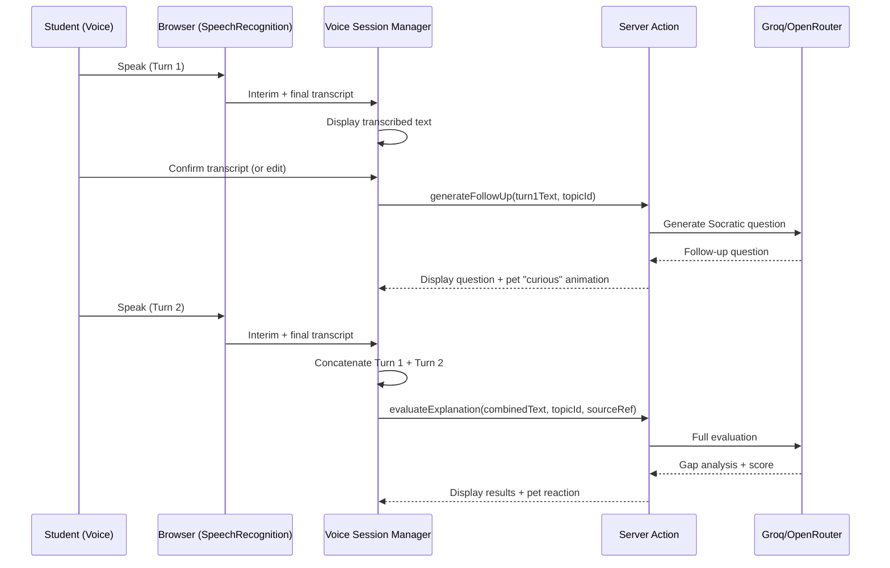

# Socratic Voice Tutor — Design

## Overview

Voice Feynman adds a voice-based Socratic dialogue mode to the existing Feynman technique workflow. It uses the browser-native Web Speech API (free, no API costs) for speech-to-text, a two-turn conversation structure for deeper probing, and feeds the transcribed result into the existing `evaluateExplanation()` pipeline unchanged.

### Key Design Decisions

1. **Web Speech API (free) over paid services**: Browser-native, zero cost, no backend transcription needed. Works in Chrome, Edge, Safari. Firefox support is limited — graceful degradation.
2. **Two-turn structure (not open-ended chat)**: Keeps sessions focused and bounded. Research shows AI Socratic dialogue with limited turns improves reflective skills (Lee et al., 2025).
3. **Reuse existing evaluation pipeline**: The voice transcript is just text — it goes through the same `evaluateExplanation()` function. No new evaluation logic needed.
4. **Client-side speech handling**: All speech recognition runs in the browser. Only the final transcript is sent to the server for evaluation.
5. **Pet as engagement driver**: Pet reacts to voice activity, creating the feeling of explaining to a listener.

---

## Architecture

```
src/app/(protected)/app/_components/feynman/
├── voice-mode-toggle.tsx        # Toggle button (hidden if no Web Speech API)
├── voice-recorder.tsx           # SpeechRecognition wrapper + transcript display
├── socratic-followup.tsx        # AI question display + Turn 2 prompt
└── voice-session-manager.tsx    # Orchestrates the 2-turn flow

src/app/(protected)/app/_actions/
├── feynman.ts                   # Extended with generateFollowUp() action
```

### Data Flow



---

## Components

### `voice-recorder.tsx`

```typescript
interface VoiceRecorderProps {
  onTranscriptComplete: (text: string) => void;
  onRecordingStateChange: (isRecording: boolean) => void;
  silenceTimeoutMs?: number; // default 3000
}
```

- Uses `window.SpeechRecognition` or `window.webkitSpeechRecognition`
- Settings: `continuous: true`, `interimResults: true`, `lang: 'en-US'`
- Auto-stops after 3s silence (configurable)
- Displays interim text in italic, final text in normal weight
- Shows editable textarea with final transcript for corrections

### `voice-session-manager.tsx`

```typescript
interface VoiceSessionProps {
  topicId: string;
  topicName: string;
  sourceRef?: SourceRef;
  onComplete: (result: FeynmanResult) => void;
}
```

State machine:
1. `idle` → user clicks "Start Speaking"
2. `recording_turn1` → collecting speech
3. `reviewing_turn1` → user reviews/edits transcript
4. `generating_followup` → LLM generating question
5. `awaiting_turn2` → showing question, waiting for response
6. `recording_turn2` → collecting response
7. `reviewing_turn2` → user reviews response
8. `evaluating` → running full evaluation
9. `complete` → showing results

### Server Action: `generateFollowUp`

```typescript
// Added to feynman.ts
export async function generateFollowUp(
  explanation: string,
  topicId: string
): Promise<{ question: string } | { error: string }>;
```

Prompt strategy: "Given this student's explanation of [topic], identify the weakest claim or biggest gap. Ask ONE specific follow-up question that would force them to think deeper about that gap. Be Socratic — don't give the answer."

---

## Pet Integration

Pet animations are triggered via existing pet state management:

| Event | Pet Animation | Duration |
|-------|---------------|----------|
| Recording starts | `listening` (tilted head) | While recording |
| AI question shown | `curious` (? bubble) | 3 seconds |
| Score ≥ 70 | `celebrate` (bounce + sparkle) | 3 seconds |
| Score < 70 | `encourage` (gentle nudge) | 3 seconds |

---

## Data Model Changes

Extend `feynman_explanations` table:

```sql
ALTER TABLE feynman_explanations ADD COLUMN mode TEXT DEFAULT 'text' CHECK (mode IN ('text', 'voice'));
```

No new tables needed — voice sessions produce the same `feynman_explanations` records.

---

## Correctness Properties

### Property 1: Minimum explanation length
*For any* Turn 1 text, evaluation SHALL only proceed if the text is at least 50 characters.
**Validates: Requirement 2.1**

### Property 2: Combined transcript construction
*For any* two-turn session with Turn 1 text T1 and Turn 2 text T2, the combined transcript passed to evaluation SHALL equal `T1 + "\n\n" + T2`.
**Validates: Requirement 2.4**

### Property 3: Skip produces valid submission
*For any* session where Turn 2 is skipped, the transcript passed to evaluation SHALL equal Turn 1 text only, with no empty appended content.
**Validates: Requirement 2.5**

### Property 4: XP reward consistency
*For any* completed voice session, exactly one `rewardAction("feynman")` call SHALL be made, identical to text mode.
**Validates: Requirement 3.3**

---

## Browser Compatibility

| Browser | Support | Notes |
|---------|---------|-------|
| Chrome 33+ | Full | Best support, uses Google servers |
| Edge 79+ | Full | Chromium-based |
| Safari 14.1+ | Full | On-device processing |
| Firefox | None | No SpeechRecognition API — toggle hidden |
| Mobile Chrome | Full | Works on Android |
| Mobile Safari | Full | iOS 14.5+ |

Detection:
```typescript
const isSupported = 'SpeechRecognition' in window || 'webkitSpeechRecognition' in window;
```

---

## Error Handling

| Scenario | Handling | User Feedback |
|----------|----------|---------------|
| Browser doesn't support Web Speech | Hide voice toggle entirely | No error shown |
| Microphone permission denied | Show permission message | "Microphone access needed for voice mode" |
| Speech recognition error | Allow retry or switch to text | "Couldn't hear you. Try again or switch to text." |
| Empty transcript after recording | Suggest mic check | "No speech detected. Check your microphone." |
| 3 consecutive failures | Disable auto-retry, suggest text | "Voice mode isn't working. Try text mode." |
| LLM timeout on follow-up | Skip follow-up, proceed to evaluate | "Couldn't generate follow-up. Evaluating your explanation." |
| Network error during evaluation | Show error, preserve transcript | "Evaluation failed. Your transcript is saved." |
