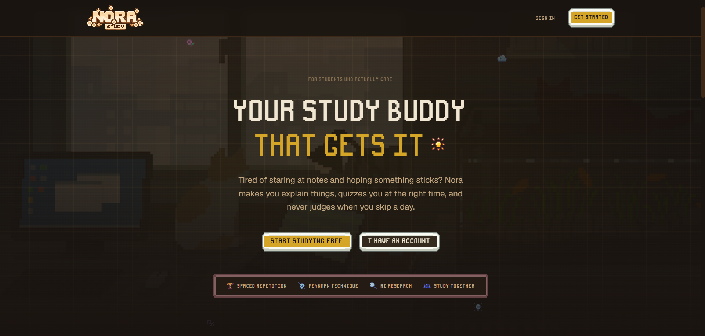

<p align="center">
  
</p>

<h1 align="center">Nora</h1>

<p align="center"><strong>A softer way to study.</strong></p>

<p align="center"><em>Built on learning science. Designed to feel like home.</em></p>

<br/>

> "You don't become knowledgeable in a day.
> You become knowledgeable one remembered idea at a time."

<br/>

<p align="center">
  
</p>

---

## A day with Nora

```
☀️  Welcome home.

    ↓

📚  Revisit three fading memories.

    ↓

💡  Explain one difficult idea.

    ↓

👁️  Catch one mistake the AI planted.

    ↓

🐾  Your companion notices you're getting better.

    ↓

    Close your laptop
    knowing a little more
    than yesterday.
```

---

## Why Nora?

Most study apps try to make you study *longer*.

Nora tries to help you understand *better*.

Instead of giving answers, it asks questions.

Instead of rewarding streaks, it celebrates growth.

Instead of replacing your thinking, it helps you build it.

---

## Meet your companion

Your companion remembers what you've been working on. It notices when something was hard yesterday. It celebrates when you finally get it.

It never judges. It never pressures. It just studies with you.

> *"I remember this one gave us trouble yesterday."*

---

## 🌱 We believe...

Understanding matters more than memorization.

Curiosity beats pressure.

AI should teach, not think for you.

Knowledge grows slowly.

And that's okay.

---

## Places inside Nora

### 🌤 Today

Start each session with a calm overview. Your companion speaks. Fading memories surface gently. No dashboards. Just clarity.

### 💡 Feynman Mode

Explain ideas in your own words until they click. Nora listens, asks deeper questions, and shows you where understanding is growing — and where it's still forming.

### 👁️ Error Spotter

The AI wrote an explanation with hidden mistakes. Can you find them? Based on the "derring effect" — catching errors strengthens understanding more than avoiding them.

### 📚 Today's Memories

Memories appear right before you'd forget them. Grade how well you remember. The ones that need more time come back sooner. The ones that feel familiar drift further away.

### 🔬 Research Desk

Ask a question. Get answers grounded in real academic papers — OpenAlex, Crossref, Unpaywall. Every citation links to a real source. When Nora isn't sure, it says so.

### 🎬 Study Room

Watch lectures. AI generates timestamped notes. Cornell mode splits your thinking into notes, questions, and summary. Every video becomes flashcards.

### 🎧 Listen Mode

Your notes become a two-voice podcast. Listen while you walk. The AI explains, then asks — and pauses so you can think.

### 🌸 Memory Garden

Each topic is a plant. Blooming means you remember well. Wilting means it's fading. Tap a wilting plant to review just those cards. Not punishment — nature.

### 🧠 Knowledge Web

See how your concepts connect across subjects. Click a node to explore its relationships. Watch mastery grow.

### ⚡ Eureka!

Surprising connections between topics you'd never link on your own. Physics meets economics. Biology meets programming. The best learning happens at the edges.

### 📖 Journal

Your story. Every explanation you wrote. Every concept you mastered. Chronological. No graphs — just the arc of becoming someone who understands.

### 📝 Practice Exam

Upload your notes. AI generates a timed exam from YOUR material. MCQ, short answer, explain-in-your-own-words. Missed questions become flashcards.

### 📅 Study Planner

Sessions spread across the week with expanding gaps. Science says spacing beats cramming. The planner does the math so you don't have to.

### 👥 Friends

Small study groups. Shared weekly goals. When someone disappears, the group gets a "check on them" quest — not a leaderboard shame.

### 📦 Card Market

Import flashcard decks from your study group with one click. Fresh scheduling — your pace, not theirs.

---

## Architecture

```
Your Notes / Papers / Videos
         ↓
    Research Desk (OpenAlex + RAG)
         ↓
    Knowledge Graph
         ↓
    Feynman Mode (explain → evaluate)
         ↓
    Flashcards + Error Spotting
         ↓
    FSRS Scheduling (optimal intervals)
         ↓
    Memory Garden (knowledge visualization)
         ↓
    Journal (who you're becoming)
```

---

## Built with

<p align="center">
  
  
  
  
  
  
  
</p>

| Layer | Technology |
|-------|-----------|
| Framework | Next.js 16 (App Router, Server Actions) |
| Language | TypeScript strict, Node.js ≥ 20 |
| UI | React 19, Tailwind v4, custom pixel-UI library (30 components) |
| Database | Supabase — Postgres, pgvector, RLS, 19 migrations |
| Auth | Supabase Auth, gated via proxy.ts |
| Spaced Repetition | ts-fsrs (MIT) — FSRS-6 DSR model |
| AI | Groq Cloud (Llama 3.3 70B), OpenRouter fallback |
| Academic Sources | OpenAlex (CC0), Crossref, Unpaywall |
| RAG | pgvector cosine + FTS → Reciprocal Rank Fusion |
| Testing | Vitest + fast-check (property-based) |

---

## Run locally

```bash
git clone https://github.com/lxcario/Nora.git
cd Nora
npm install
cp .env.example .env.local
# Add your keys (minimum: Supabase + Groq)
npm run dev
```

Open [localhost:3000](http://localhost:3000).

---

## Evidence base

| Feature | Research |
|---|---|
| FSRS scheduler | Ye (2022) — reduces review load ~20-30% vs SM-2 |
| Interleaving | Brunmair & Richter (2019) — g = 0.34 (math), −0.39 (vocab) |
| Spacing | Cepeda et al. (2008) — optimal lag by retention interval |
| Error spotting | Springer (2023) — deliberate erring enhances far-transfer |
| Calibration | MIT (2025) — metacognitive feedback transforms study behavior |
| Self-explanation | Chi (2000); Fiorella & Mayer (2016) |
| Podcasts | arxiv 2409.04645 — personalized audio improves outcomes |

---

## Contributing

Read `docs/VOICE.md` first. It defines how Nora speaks.

Then `docs/DESIGN_PRINCIPLES.md`. Five rules.

If your change makes Nora feel more like Nora — welcome.

---

## License

MIT

---

<p align="center">
  <br/>
  🌱
  <br/><br/>
  <em>Knowledge grows slowly.</em>
  <br/>
  <em>Thank you for growing with Nora.</em>
  <br/><br/>
  <strong>Built by <a href="https://github.com/lxcario">Resque</a>.</strong>
</p>
