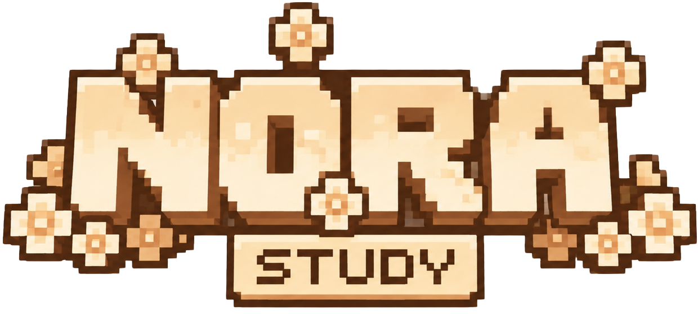

# README Audit

Read as a first-time visitor landing on the repo, then as an open-source contributor deciding whether to care.

**Verdict up front:** The README is the *best-written artifact in the entire project.* It is more on-voice than the actual landing page (`landing-content.tsx`), which is an inversion worth noting — the marketing page should be lifted to the README's level, not the reverse. Most of this audit is therefore "protect what's here and tighten the edges," not "rewrite."

Let me answer the four questions the brief asks.

---

## Would this feel memorable? — Yes.

The opening lands. The wordmark, "A softer way to study," "Built on learning science. Designed to feel like home," and the epigraph ("You become knowledgeable one remembered idea at a time") establish voice and thesis in the first screen. The **"A day with Nora"** ASCII flow is the standout — it's concrete, calm, and sequences the product as a *lived day* rather than a feature list. That's a genuinely memorable README device; most projects open with a logo and a bullet list of buzzwords. This one opens with a feeling.

**Keep, don't touch:** the epigraph, the "A day with Nora" block, the "We believe…" section, and the closing 🌱 / "Knowledge grows slowly."

---

## Would I understand Nora's philosophy? — Yes, mostly.

"Why Nora?" nails the differentiation in three lines (asks questions vs gives answers; growth vs streaks; builds your thinking vs replaces it). The "Places inside Nora" section is the right metaphor — *places*, matching `docs/CRAFT.md`'s "Places, not pages."

**One philosophical snag:** The README brags "Instead of rewarding streaks, it celebrates growth" — but the app currently ships a streak counter (see AI_SLOP_AUDIT P0-3 / UX_CRAFT_AUDIT P0-A). A sharp contributor who reads the README, then runs the app, will catch the contradiction immediately and trust the project a little less. The README is making a promise the code breaks. Fix the code (preferred) or soften the claim — but don't let them disagree.

---

## Would I star it / feel inspired to contribute? — Mostly yes, with friction.

What works for contributors:
- The "Contributing" section is *perfect for this project*: "Read `docs/VOICE.md` first… Then `docs/DESIGN_PRINCIPLES.md`. Five rules. If your change makes Nora feel more like Nora — welcome." That's a culture statement, not boilerplate. It signals the bar.
- The "Evidence base" table (FSRS, interleaving, spacing, error-spotting, calibration with citations) is *credibility gold* — it tells a serious contributor this isn't vibes, it's grounded. Keep it.
- "Built with" badges + stack table are clear.

What creates friction or risk:

### R-1 · Unverifiable / risky specific claims (Medium)
- **"tests — 332 passing"** badge and "332 tests passing" in `PRODUCT_DESCRIPTION.md`. A hardcoded test count in a README rots fast and invites "actually it's 318" PRs. Either make it a live CI badge or soften to "extensively tested (Vitest + property-based)."
- The feature list under "Places inside Nora" is generous (Listen Mode, Knowledge Web, Eureka, Practice Exam, Card Market, Memory Garden…). These do exist as routes, but a first-time visitor will assume each is *polished and complete*. If some are early/experimental, a tiny honesty marker ("✦ early") protects trust — `docs/CRAFT.md`'s "Honest. If we're not sure, we say so" applies to the README too.

### R-2 · The repo's first impression isn't only the README (High, meta)
A visitor browsing the repo root sees the README **next to** a pile of working docs: `geminiresearch.md`, `uiuxgpt.md`, `deep-research-report.md`, `whatisthis.md`, `HACKATHON-PLAN.md`, `NORA-AWWWARDS-SPEC.md`, `FrontendOptimization.md`, plus the seven audit files this review adds. The README is beautiful; the root directory looks like a scratchpad. That dissonance undercuts the "handmade, considered" impression the README works to create.
**Fix:** Move working notes into `docs/notes/` or `docs/research/`; keep the root to README, LICENSE, config, and `src/`. A tidy root *is* craft.

### R-3 · Small voice/detail nits (Low)
- `alt="NORA"` (all-caps) on the logo images in both README and landing — the brand is "Nora." All-caps reads as shouting to a screen reader and contradicts the quiet tone. Use `alt="Nora"`.
- "Error Spotter" description says it's based on the **"derring effect"** — the research term is *deliberate erring* / the productive-failure literature. "Derring effect" isn't a standard name and will look like a hallucinated citation to an academic reader. Either name it precisely ("based on research on productive failure / deliberate erring") or cite the Springer 2023 source you already list. Honesty + precision = trust.
- The section emojis (🌤💡👁️📚🔬🎬🎧🌸🧠⚡📖📝📅👥📦) are warm and I'd keep most — but 15 of them in a row drifts toward "AI-generated feature list." Consider thinning to the few that carry meaning; restraint is the brand (`docs/CRAFT.md` #5).
- "Run locally" points to `https://github.com/lxcario/Nora.git` while the byline credits "Resque" linking to `github.com/lxcario`. Make sure the clone URL, byline, and repo all agree (a visitor *will* notice a mismatched handle).

---

## Concrete rewrites

**Logo alt (both files):**
```html
<!-- before -->   ✅ (README is already "Nora" — good)
<!-- landing-content.tsx --> alt="NORA"  →  alt="Nora"
```

**Streak claim (only if the code keeps a streak; otherwise fix the code):**
> before: "Instead of rewarding streaks, it celebrates growth."
> safe:   "Instead of punishing missed days, it watches understanding grow."

**Test badge:**
> before: `tests — 332 passing`
> after:  a live CI badge, or `tested — Vitest + property-based`

**Error Spotter line:**
> before: "Based on the 'derring effect' — catching errors strengthens understanding…"
> after:  "Based on research on productive failure — deliberately spotting and correcting errors strengthens far-transfer learning (Springer, 2023)."

**Add a one-line "status" near the top (honesty about maturity):**
> *Nora is in active development. The core loop — explain, remember, research — is solid; some places are still being furnished.*

This single line turns "is all of this real?" skepticism into "I respect that they told me."

---

## What I would *not* change

- The voice, the epigraph, the "A day with Nora" flow, "We believe…", the closing.
- The "Contributing" section — it's a model for value-driven OSS onboarding.
- The evidence table — keep and expand it; it's a differentiator.

---

## Scorecard

| Question | Answer |
|---|---|
| Memorable? | Yes — top 5% of READMEs on voice and structure |
| Understand the philosophy? | Yes — with one self-contradiction (streaks) to resolve |
| Sounds human? | Yes — more human than the app's own landing page |
| Would a contributor feel inspired? | Yes — the Contributing + Evidence sections do real work |
| Risks | Hardcoded test count, possibly-aspirational feature list, messy repo root, "derring effect" term, handle/URL mismatch |

**Net:** Don't rewrite the README. Resolve the streak contradiction so it stays *true*, tidy the repo root so the first impression matches the README's care, soften the few unverifiable specifics, and fix the small precision nits. The hard part — voice — is already done, and done well.
